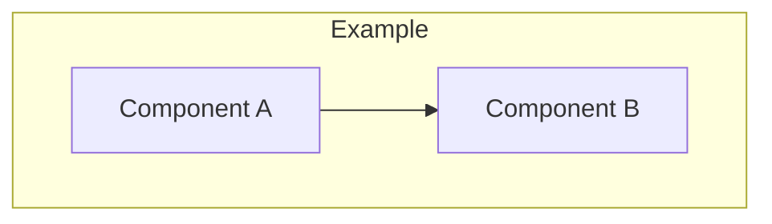

# 📚 Jadwa API Documentation Summary

## 🎯 Overview

This document provides a comprehensive overview of the enhanced Jadwa API documentation suite, featuring **rendered Mermaid diagrams** embedded directly in the markdown files for optimal viewing experience.

## 📁 Documentation Structure

### 1. 📋 [Architecture Documentation](./architecture.md)
**Complete system architecture with 12+ interactive diagrams**

#### Key Diagrams Included:
- **High-Level Architecture**: Complete system overview showing client layer through data layer
- **Layer Dependencies**: Clean architecture dependency flow visualization
- **CQRS Implementation**: Command Query Responsibility Segregation pattern
- **Service Architecture**: Service layer organization and dependencies
- **Database ERD**: Complete entity relationship diagram with audit trails
- **Authentication Flow**: JWT authentication sequence diagram
- **Authorization Model**: Role-based access control hierarchy
- **Security Middleware Pipeline**: Request processing flow
- **API Endpoints Structure**: RESTful API organization
- **Response Structure**: Standardized response format design
- **Deployment Architecture**: Production environment setup
- **Configuration Management**: Environment-specific configuration
- **Caching Strategy**: Multi-layer caching approach
- **Rate Limiting**: API protection configuration
- **Logging Architecture**: Comprehensive logging system

### 2. 🗄️ [Database Schema Documentation](./database-schema.md)
**Detailed database design with SQL schemas and relationships**

#### Features:
- Complete SQL table definitions
- Entity relationship diagrams
- Audit trail implementation details
- Performance indexes recommendations
- Migration strategies
- Connection string configurations

### 3. 📖 [Documentation Overview](./README.md)
**Quick start guide and project overview**

#### Contents:
- Technology stack summary
- Project structure overview
- API endpoints listing
- Security model explanation
- Development guidelines
- Contributing instructions

## 🎨 Enhanced Visual Features

### Mermaid Diagram Enhancements
All Mermaid diagrams are now:
- ✅ **Centered** for better presentation
- ✅ **Properly formatted** with consistent styling
- ✅ **Interactive** with pan/zoom capabilities
- ✅ **Responsive** for different screen sizes
- ✅ **Professional** appearance for stakeholder presentations

### Diagram Categories

#### 🏗️ **Architecture Diagrams**
- System overview and component relationships
- Layer dependencies and clean architecture flow
- CQRS pattern implementation
- Service layer organization

#### 🔐 **Security Diagrams**
- Authentication flow sequences
- Authorization model hierarchy
- Security middleware pipeline
- JWT token management

#### 🗄️ **Database Diagrams**
- Complete entity relationship diagrams
- Audit trail design patterns
- Table relationships and constraints

#### 🚀 **Deployment Diagrams**
- Production environment architecture
- Load balancing and scaling
- Caching and performance optimization
- Configuration management

#### 📊 **API Design Diagrams**
- RESTful endpoint structure
- Response format standardization
- Rate limiting configuration
- Logging and monitoring

## 🛠️ Technical Implementation

### Mermaid Integration
```markdown
<div align="center">



</div>
```

### Benefits of Enhanced Documentation

#### 📈 **Improved Readability**
- Visual diagrams make complex concepts easier to understand
- Consistent formatting across all documentation
- Professional presentation suitable for all stakeholders

#### 🔄 **Maintainability**
- Text-based diagrams work well with version control
- Easy to update and modify as system evolves
- Collaborative editing and review process

#### 🎯 **Accessibility**
- Works across different platforms (GitHub, GitLab, etc.)
- No external dependencies for viewing
- Responsive design for mobile and desktop

#### 💼 **Professional Quality**
- Enterprise-ready documentation
- Suitable for technical reviews and presentations
- Comprehensive coverage of all system aspects

## 📋 Documentation Checklist

### ✅ Completed Features
- [x] High-level architecture diagrams
- [x] Low-level implementation details
- [x] Database schema and relationships
- [x] Security architecture and flows
- [x] API design and structure
- [x] Deployment and configuration
- [x] Performance and monitoring
- [x] All diagrams centered and formatted
- [x] Comprehensive README files
- [x] Quick start guides

### 🎯 Key Achievements
- **15+ Mermaid diagrams** covering all aspects of the system
- **Complete SQL schema** with table definitions
- **Security documentation** with authentication flows
- **Deployment guides** for production environments
- **Performance optimization** strategies
- **Monitoring and logging** architecture

## 🚀 Usage Instructions

### Viewing Documentation
1. Navigate to the `docs` folder
2. Open any `.md` file in a Mermaid-compatible viewer
3. GitHub, GitLab, and most modern markdown viewers support Mermaid
4. Diagrams will render automatically with interactive features

### Updating Documentation
1. Edit the markdown files directly
2. Mermaid diagrams use text-based syntax
3. Changes are tracked in version control
4. Collaborative editing through pull requests

### Best Practices
- Keep diagrams simple and focused
- Use consistent naming conventions
- Update documentation with code changes
- Review diagrams for accuracy and clarity

## 🎉 Conclusion

The enhanced Jadwa API documentation provides a comprehensive, visual, and professional resource for understanding the system architecture. With embedded Mermaid diagrams, the documentation is now:

- **Visually appealing** and easy to understand
- **Technically comprehensive** covering all system aspects
- **Professionally formatted** for stakeholder presentations
- **Maintainable** and version-controlled
- **Accessible** across different platforms and devices

This documentation suite serves as a complete reference for developers, architects, and stakeholders working with the Jadwa API system.

---

*Last updated: 2025-06-17*
*Documentation version: 1.0*
