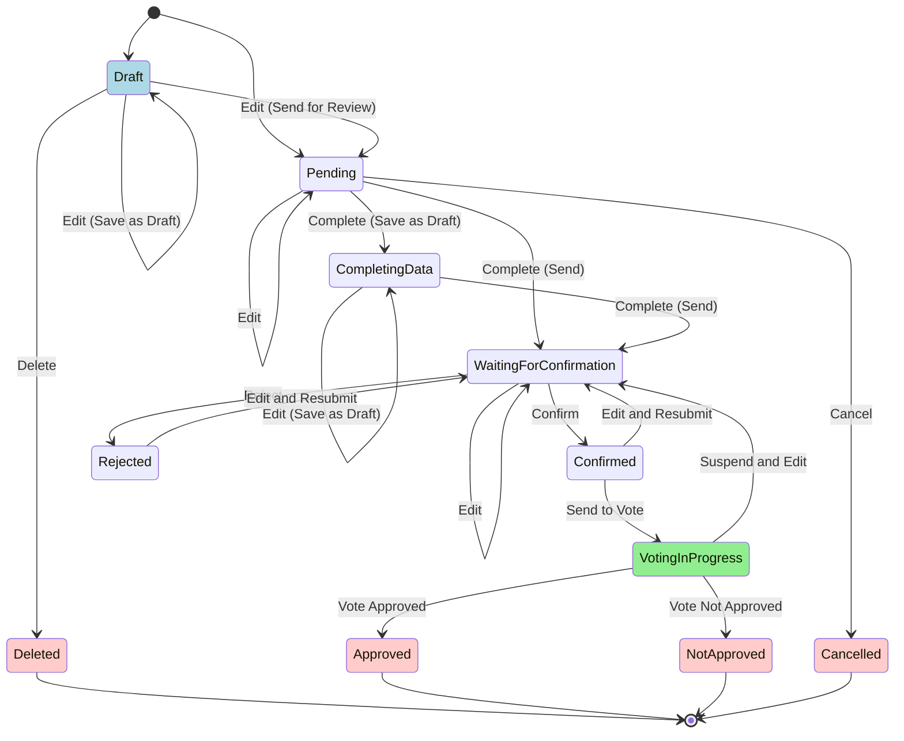

# Resolution State Pattern Documentation

## Overview

This document describes the State Pattern implementation for Resolution entity state management in the Jadwa Fund Management System. The implementation follows Clean Architecture principles and provides robust state transition management based on business rules defined in Sprint.md.

## Business Context

The Resolution State Pattern manages the complete lifecycle of fund resolutions from creation to final approval/rejection. The implementation supports the following user stories from Sprint 2:

- **JDWA-511**: Create a resolution (Fund Manager)
- **JDWA-505**: Complete resolution data - attachments (Legal Council/Board Secretary)
- **JDWA-506**: Complete resolution data - basic info (Legal Council/Board Secretary)
- **JDWA-507**: Complete resolution data - items and conflicts (Legal Council/Board Secretary)
- **JDWA-508**: Cancel a pending resolution (Fund Manager)
- **JDWA-509**: Edit a draft/pending resolution (Fund Manager)
- **JDWA-510**: Delete a draft resolution (Fund Manager)
- **JDWA-566**: Edit resolution items (Legal Council/Board Secretary)
- **JDWA-567**: Edit resolution attachments (Legal Council/Board Secretary)
- **JDWA-568**: Confirm/Reject resolution (Fund Manager)
- **JDWA-569**: Send resolution to vote (Legal Council/Board Secretary)
- **JDWA-570**: View resolution details (All roles)

## State Transition Diagram

The following diagram shows all possible state transitions and the conditions under which they occur:

### State Descriptions

| State | Description | Allowed Roles | User Stories | Terminal |
|-------|-------------|---------------|--------------|----------|
| **Draft** | Initial state for new resolutions. Can be edited, sent for review, or deleted. | Fund Manager | JDWA-511, JDWA-509, JDWA-510 | No |
| **Pending** | Sent for legal review. Can be cancelled by Fund Manager or completed by Legal Council/Board Secretary. | Fund Manager (edit/cancel), Legal Council/Board Secretary (complete) | JDWA-509, JDWA-508, JDWA-506, JDWA-507 | No |
| **CompletingData** | Legal Council/Board Secretary completing resolution data. Can save as draft or send for confirmation. | Legal Council/Board Secretary | JDWA-506, JDWA-507, JDWA-566, JDWA-567 | No |
| **WaitingForConfirmation** | Waiting for Fund Manager confirmation. Can be confirmed, rejected, or edited by Legal Council/Board Secretary. | Fund Manager (confirm/reject), Legal Council/Board Secretary (edit) | JDWA-568, JDWA-566, JDWA-567 | No |
| **Confirmed** | Confirmed by Fund Manager. Ready for voting or can be edited and resubmitted. | Legal Council/Board Secretary | JDWA-569, JDWA-566, JDWA-567 | No |
| **Rejected** | Rejected by Fund Manager. Can be edited and resubmitted by Legal Council/Board Secretary. | Legal Council/Board Secretary | JDWA-566, JDWA-567 | No |
| **VotingInProgress** | Active voting process. Can result in approval/rejection or be suspended for editing. | System (voting), Legal Council/Board Secretary (suspend) | JDWA-569 | No |
| **Approved** | Resolution approved after voting. No further transitions allowed. | None | Voting Process | **Yes** |
| **NotApproved** | Resolution not approved after voting. No further transitions allowed. | None | Voting Process | **Yes** |
| **Cancelled** | Resolution cancelled by Fund Manager. No further transitions allowed. | None | JDWA-508 | **Yes** |
| **Deleted** | Draft resolution deleted by Fund Manager. No further transitions allowed. | None | JDWA-510 | **Yes** |

## State Machine Flow

The following flowchart illustrates the complete resolution lifecycle with decision points:

```mermaid
flowchart TD
    Start([Start: Create Resolution]) --> CreateDecision{SaveAsDraft?}
    
    CreateDecision -->|Yes| DraftState[Draft State<br/>JDWA-511]
    CreateDecision -->|No| PendingState[Pending State<br/>JDWA-511]
    
    DraftState --> DraftActions{User Action}
    DraftActions -->|Edit + SaveAsDraft| DraftState
    DraftActions -->|Edit + Send| PendingState
    DraftActions -->|Delete| DeletedEnd([Deleted<br/>JDWA-510])
    
    PendingState --> PendingActions{User Action}
    PendingActions -->|Edit by Fund Manager| PendingState
    PendingActions -->|Cancel by Fund Manager| CancelledEnd([Cancelled<br/>JDWA-508])
    PendingActions -->|Complete by Legal/Board Secretary| CompleteDecision{SaveAsDraft?}
    
    CompleteDecision -->|Yes| CompletingDataState[CompletingData State<br/>JDWA-506/507]
    CompleteDecision -->|No| WaitingState[WaitingForConfirmation State<br/>JDWA-506/507]
    
    CompletingDataState --> CompletingActions{User Action}
    CompletingActions -->|Edit + SaveAsDraft| CompletingDataState
    CompletingActions -->|Edit + Send| WaitingState
    
    WaitingState --> WaitingActions{Fund Manager Action}
    WaitingActions -->|Confirm| ConfirmedState[Confirmed State<br/>JDWA-568]
    WaitingActions -->|Reject| RejectedState[Rejected State<br/>JDWA-568]
    WaitingActions -->|Legal/Board Secretary Edit| WaitingState
    
    ConfirmedState --> ConfirmedActions{User Action}
    ConfirmedActions -->|Send to Vote| VotingState[VotingInProgress State<br/>JDWA-569]
    ConfirmedActions -->|Edit and Resubmit| WaitingState
    
    RejectedState -->|Edit and Resubmit| WaitingState
    
    VotingState --> VotingResult{Voting Result}
    VotingResult -->|Approved| ApprovedEnd([Approved<br/>Terminal State])
    VotingResult -->|Not Approved| NotApprovedEnd([Not Approved<br/>Terminal State])
    VotingResult -->|Suspend and Edit| WaitingState
    
    style DraftState fill:#e1f5fe
    style PendingState fill:#fff3e0
    style CompletingDataState fill:#f3e5f5
    style WaitingState fill:#e8f5e8
    style ConfirmedState fill:#e0f2f1
    style RejectedState fill:#ffebee
    style VotingState fill:#f1f8e9
    style ApprovedEnd fill:#c8e6c9
    style NotApprovedEnd fill:#ffcdd2
    style CancelledEnd fill:#ffcdd2
    style DeletedEnd fill:#f5f5f5
```

## Class Diagram

The following diagram shows the State Pattern implementation structure:

```mermaid
classDiagram
    class IResolutionState {
        <<interface>>
        +ResolutionStatusEnum Status
        +Handle(Resolution resolution) void
        +CanTransitionTo(ResolutionStatusEnum targetStatus) bool
        +GetAllowedTransitions() IEnumerable~ResolutionStatusEnum~
        +CanEdit() bool
        +CanComplete() bool
        +CanCancel() bool
        +GetValidationMessages() IEnumerable~string~
        +GetStateDescriptionKey() string
    }

    class ResolutionStateFactory {
        <<static>>
        +CreateState(ResolutionStatusEnum status) IResolutionState
        +GetInitialState(bool saveAsDraft) IResolutionState
        +IsTransitionAllowed(ResolutionStatusEnum current, ResolutionStatusEnum target) bool
        +GetAllowedTransitions(ResolutionStatusEnum current) IEnumerable~ResolutionStatusEnum~
        +CanEdit(ResolutionStatusEnum current) bool
        +CanComplete(ResolutionStatusEnum current) bool
        +CanCancel(ResolutionStatusEnum current) bool
    }

    class ResolutionStateContext {
        -IResolutionState _currentState
        -Resolution _resolution
        +CurrentState IResolutionState
        +TransitionTo(ResolutionStatusEnum targetStatus, string reason) bool
        +CanTransitionTo(ResolutionStatusEnum targetStatus) bool
        +GetAllowedTransitions() IEnumerable~ResolutionStatusEnum~
        +CanEdit() bool
        +CanComplete() bool
        +CanCancel() bool
        +GetValidationMessages() IEnumerable~string~
        +Handle() void
        +InitializeState() void
    }

    class Resolution {
        +ResolutionStatusEnum Status
        +ResolutionStateContext StateContext
        +InitializeState() void
        +ChangeStatus(ResolutionStatusEnum targetStatus, string reason) bool
        +CanTransitionTo(ResolutionStatusEnum targetStatus) bool
        +GetAllowedTransitions() IEnumerable~ResolutionStatusEnum~
        +CanEdit() bool
        +CanComplete() bool
        +CanCancel() bool
        +GetStateValidationMessages() IEnumerable~string~
    }

    class DraftResolutionState {
        +Status ResolutionStatusEnum.Draft
        +Handle(Resolution resolution) void
        +CanTransitionTo(ResolutionStatusEnum targetStatus) bool
        +GetAllowedTransitions() IEnumerable~ResolutionStatusEnum~
        +CanEdit() bool : true
        +CanComplete() bool : true
        +CanCancel() bool : false
        +GetValidationMessages() IEnumerable~string~
        +GetStateDescriptionKey() string : "ResolutionInDraftState"
    }

    class PendingResolutionState {
        +Status ResolutionStatusEnum.Pending
        +Handle(Resolution resolution) void
        +CanTransitionTo(ResolutionStatusEnum targetStatus) bool
        +GetAllowedTransitions() IEnumerable~ResolutionStatusEnum~
        +CanEdit() bool : true
        +CanComplete() bool : true
        +CanCancel() bool : true
        +GetValidationMessages() IEnumerable~string~
        +GetStateDescriptionKey() string : "ResolutionInPendingState"
    }

    class CompletingDataResolutionState {
        +Status ResolutionStatusEnum.CompletingData
        +Handle(Resolution resolution) void
        +CanTransitionTo(ResolutionStatusEnum targetStatus) bool
        +GetAllowedTransitions() IEnumerable~ResolutionStatusEnum~
        +CanEdit() bool : true
        +CanComplete() bool : true
        +CanCancel() bool : false
        +GetValidationMessages() IEnumerable~string~
        +GetStateDescriptionKey() string : "ResolutionInCompletingDataState"
    }

    class WaitingForConfirmationResolutionState {
        +Status ResolutionStatusEnum.WaitingForConfirmation
        +Handle(Resolution resolution) void
        +CanTransitionTo(ResolutionStatusEnum targetStatus) bool
        +GetAllowedTransitions() IEnumerable~ResolutionStatusEnum~
        +CanEdit() bool : true
        +CanComplete() bool : false
        +CanCancel() bool : false
        +GetValidationMessages() IEnumerable~string~
        +GetStateDescriptionKey() string : "ResolutionInWaitingForConfirmationState"
    }

    class ConfirmedResolutionState {
        +Status ResolutionStatusEnum.Confirmed
        +Handle(Resolution resolution) void
        +CanTransitionTo(ResolutionStatusEnum targetStatus) bool
        +GetAllowedTransitions() IEnumerable~ResolutionStatusEnum~
        +CanEdit() bool : true
        +CanComplete() bool : false
        +CanCancel() bool : false
        +GetValidationMessages() IEnumerable~string~
        +GetStateDescriptionKey() string : "ResolutionInConfirmedState"
    }

    class RejectedResolutionState {
        +Status ResolutionStatusEnum.Rejected
        +Handle(Resolution resolution) void
        +CanTransitionTo(ResolutionStatusEnum targetStatus) bool
        +GetAllowedTransitions() IEnumerable~ResolutionStatusEnum~
        +CanEdit() bool : true
        +CanComplete() bool : false
        +CanCancel() bool : false
        +GetValidationMessages() IEnumerable~string~
        +GetStateDescriptionKey() string : "ResolutionInRejectedState"
    }

    class VotingInProgressResolutionState {
        +Status ResolutionStatusEnum.VotingInProgress
        +Handle(Resolution resolution) void
        +CanTransitionTo(ResolutionStatusEnum targetStatus) bool
        +GetAllowedTransitions() IEnumerable~ResolutionStatusEnum~
        +CanEdit() bool : true
        +CanComplete() bool : false
        +CanCancel() bool : false
        +GetValidationMessages() IEnumerable~string~
        +GetStateDescriptionKey() string : "ResolutionInVotingInProgressState"
    }

    class ApprovedResolutionState {
        +Status ResolutionStatusEnum.Approved
        +Handle(Resolution resolution) void
        +CanTransitionTo(ResolutionStatusEnum targetStatus) bool : false
        +GetAllowedTransitions() IEnumerable~ResolutionStatusEnum~ : Empty
        +CanEdit() bool : false
        +CanComplete() bool : false
        +CanCancel() bool : false
        +GetValidationMessages() IEnumerable~string~
        +GetStateDescriptionKey() string : "ResolutionInApprovedState"
    }

    class NotApprovedResolutionState {
        +Status ResolutionStatusEnum.NotApproved
        +Handle(Resolution resolution) void
        +CanTransitionTo(ResolutionStatusEnum targetStatus) bool : false
        +GetAllowedTransitions() IEnumerable~ResolutionStatusEnum~ : Empty
        +CanEdit() bool : false
        +CanComplete() bool : false
        +CanCancel() bool : false
        +GetValidationMessages() IEnumerable~string~
        +GetStateDescriptionKey() string : "ResolutionInNotApprovedState"
    }

    class CancelledResolutionState {
        +Status ResolutionStatusEnum.Cancelled
        +Handle(Resolution resolution) void
        +CanTransitionTo(ResolutionStatusEnum targetStatus) bool : false
        +GetAllowedTransitions() IEnumerable~ResolutionStatusEnum~ : Empty
        +CanEdit() bool : false
        +CanComplete() bool : false
        +CanCancel() bool : false
        +GetValidationMessages() IEnumerable~string~
        +GetStateDescriptionKey() string : "ResolutionInCancelledState"
    }

    %% Relationships
    IResolutionState <|.. DraftResolutionState
    IResolutionState <|.. PendingResolutionState
    IResolutionState <|.. CompletingDataResolutionState
    IResolutionState <|.. WaitingForConfirmationResolutionState
    IResolutionState <|.. ConfirmedResolutionState
    IResolutionState <|.. RejectedResolutionState
    IResolutionState <|.. VotingInProgressResolutionState
    IResolutionState <|.. ApprovedResolutionState
    IResolutionState <|.. NotApprovedResolutionState
    IResolutionState <|.. CancelledResolutionState

    ResolutionStateFactory ..> IResolutionState : creates
    ResolutionStateContext --> IResolutionState : uses
    ResolutionStateContext --> Resolution : manages
    Resolution --> ResolutionStateContext : contains

    note for IResolutionState "Base interface defining\nstate behavior contract"
    note for ResolutionStateFactory "Factory for creating\nstate instances"
    note for ResolutionStateContext "Context managing\nstate transitions"
    note for Resolution "Entity with integrated\nstate pattern"
    note for ApprovedResolutionState "Terminal State:\nNo transitions allowed"
    note for NotApprovedResolutionState "Terminal State:\nNo transitions allowed"
    note for CancelledResolutionState "Terminal State:\nNo transitions allowed"
```

## Business Rules and State Transitions

### State Transition Matrix

| From State | To States | Conditions | User Roles | User Stories |
|------------|-----------|------------|------------|--------------|
| **Draft** | Draft | SaveAsDraft=true | Fund Manager | JDWA-509, JDWA-511 |
| **Draft** | Pending | SaveAsDraft=false | Fund Manager | JDWA-509, JDWA-511 |
| **Draft** | Deleted | Delete action | Fund Manager | JDWA-510 |
| **Pending** | Pending | Edit action | Fund Manager | JDWA-509 |
| **Pending** | CompletingData | SaveAsDraft=true | Legal Council/Board Secretary | JDWA-506, JDWA-507 |
| **Pending** | WaitingForConfirmation | SaveAsDraft=false | Legal Council/Board Secretary | JDWA-506, JDWA-507 |
| **Pending** | Cancelled | Cancel action | Fund Manager | JDWA-508 |
| **CompletingData** | CompletingData | SaveAsDraft=true | Legal Council/Board Secretary | JDWA-566, JDWA-567 |
| **CompletingData** | WaitingForConfirmation | SaveAsDraft=false | Legal Council/Board Secretary | JDWA-566, JDWA-567 |
| **WaitingForConfirmation** | Confirmed | Confirm action | Fund Manager | JDWA-568 |
| **WaitingForConfirmation** | Rejected | Reject action | Fund Manager | JDWA-568 |
| **WaitingForConfirmation** | WaitingForConfirmation | Edit action | Legal Council/Board Secretary | JDWA-566, JDWA-567 |
| **Confirmed** | VotingInProgress | Send to vote | Legal Council/Board Secretary | JDWA-569 |
| **Confirmed** | WaitingForConfirmation | Edit and resubmit | Legal Council/Board Secretary | JDWA-566, JDWA-567 |
| **Rejected** | WaitingForConfirmation | Edit and resubmit | Legal Council/Board Secretary | JDWA-566, JDWA-567 |
| **VotingInProgress** | Approved | Voting complete (approved) | System | Voting Process |
| **VotingInProgress** | NotApproved | Voting complete (not approved) | System | Voting Process |
| **VotingInProgress** | WaitingForConfirmation | Suspend voting and edit | Legal Council/Board Secretary | JDWA-566, JDWA-567 |

### Terminal States

The following states are terminal and do not allow any further transitions:

- **Approved**: Resolution has been successfully approved through voting
- **NotApproved**: Resolution was not approved through voting
- **Cancelled**: Resolution was cancelled by Fund Manager
- **Deleted**: Draft resolution was deleted by Fund Manager

### User Role Permissions

#### Fund Manager
- Create resolutions (Draft/Pending)
- Edit Draft/Pending resolutions
- Cancel Pending resolutions
- Delete Draft resolutions
- Confirm/Reject resolutions waiting for confirmation

#### Legal Council / Board Secretary
- Complete resolution data (basic info, items, attachments)
- Edit resolution items and attachments
- Send confirmed resolutions to voting
- Edit and resubmit rejected resolutions

#### Board Members
- View resolution details
- Participate in voting process

### State-Specific Business Rules

#### Draft State
- **Allowed Operations**: Edit, Send for review, Delete
- **Restrictions**: Cannot be cancelled (use delete instead)
- **Notifications**: None (internal state)

#### Pending State
- **Allowed Operations**: Edit (Fund Manager), Complete (Legal/Board Secretary), Cancel
- **Restrictions**: Cannot be deleted once pending
- **Notifications**: Legal Council and Board Secretary notified when created

#### CompletingData State
- **Allowed Operations**: Edit data, Save as draft, Send for confirmation
- **Restrictions**: Cannot be cancelled while completing data
- **Notifications**: None (intermediate state)

#### WaitingForConfirmation State
- **Allowed Operations**: Confirm, Reject (Fund Manager), Edit (Legal/Board Secretary)
- **Restrictions**: Limited editing allowed
- **Notifications**: Fund Manager notified when ready for confirmation

#### Confirmed State
- **Allowed Operations**: Send to vote, Edit and resubmit
- **Restrictions**: Cannot be cancelled once confirmed
- **Notifications**: Legal Council and Board Secretary notified

#### Rejected State
- **Allowed Operations**: Edit and resubmit
- **Restrictions**: Cannot be cancelled or deleted
- **Notifications**: All stakeholders notified of rejection

#### VotingInProgress State
- **Allowed Operations**: Complete voting, Suspend and edit
- **Restrictions**: Limited editing (requires voting suspension)
- **Notifications**: All board members notified when voting starts

## Implementation Details

### State Pattern Components

1. **IResolutionState Interface**: Defines the contract for all resolution states
2. **Concrete State Classes**: Implement specific behavior for each resolution status
3. **ResolutionStateFactory**: Creates appropriate state instances
4. **ResolutionStateContext**: Manages state transitions and validation
5. **Resolution Entity**: Integrates state pattern for lifecycle management

### Key Features

- **Validation**: Each state validates allowed operations and transitions
- **Localization**: State descriptions and error messages support Arabic/English
- **Audit Trail**: All state transitions are logged with reasons
- **Clean Architecture**: No Entity Framework references in Application layer
- **CQRS Compliance**: Integrates with existing command/query patterns

### Error Handling

The implementation includes comprehensive error handling with localized messages:

- `InvalidStatusTransition`: When attempting invalid state transitions
- `CannotEditInCurrentState`: When editing is not allowed in current state
- `CannotCompleteInCurrentState`: When completion is not allowed
- `CannotCancelInCurrentState`: When cancellation is not allowed

### Integration with Command Handlers

All resolution command handlers have been updated to use the state pattern:

- **AddResolutionCommandHandler**: Uses state pattern for initial status setting
- **EditResolutionCommandHandler**: Validates editing permissions using state pattern
- **CompleteResolutionDataCommandHandler**: Uses state pattern for completion transitions
- **CancelResolutionCommandHandler**: Validates cancellation using state pattern
- **EditResolutionItemsCommandHandler**: Uses state pattern for item editing transitions
- **EditResolutionAttachmentsCommandHandler**: Uses state pattern for attachment editing

This implementation ensures consistent state management across all resolution operations while maintaining backward compatibility with existing functionality.
