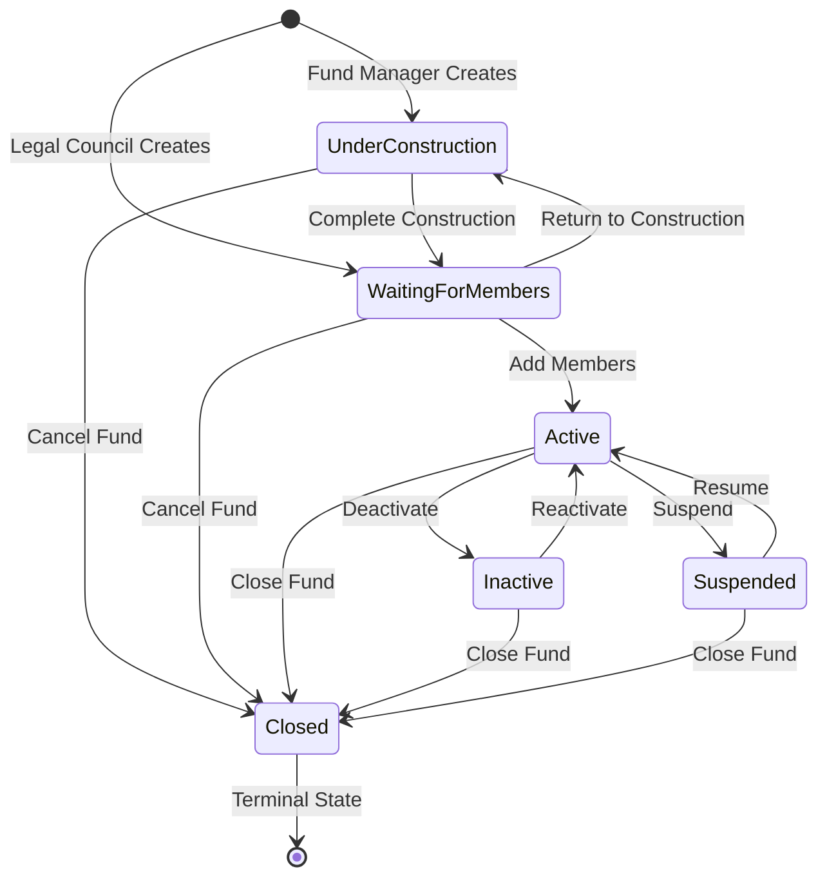

# Fund State Pattern Usage Guide

## Overview

The Fund State Pattern implementation provides a robust way to manage fund status transitions and enforce business rules. This document demonstrates how to use the State Pattern in the Jadwa API project.

## Architecture

The State Pattern implementation consists of:

1. **FundStateBase** - Abstract base class defining the state interface
2. **Concrete State Classes** - Implementation for each fund status
3. **FundStateFactory** - Factory for creating state instances
4. **Fund Entity Integration** - Methods for state management

## State Diagram



## Usage Examples

### 1. Creating a Fund with Initial State

```csharp
// In AddFundCommandHandler
var fund = _mapper.Map<Fund>(request);

// Set initial status based on user role
var initialStatus = currentUserRole.ToLower() switch
{
    "fundmanager" => FundStatus.UnderConstruction,
    "legalcouncil" => FundStatus.WaitingForMembers,
    _ => FundStatus.UnderConstruction
};

fund.Status = initialStatus;
fund.InitializeState(); // Initialize state pattern

await _repository.Funds.AddAsync(fund);
```

### 2. Changing Fund Status with Validation

```csharp
// In EditFundCommandHandler
var fund = await _repository.Funds.GetByIdAsync(request.Id);

// Initialize state if not already initialized
if (fund.CurrentState == null)
{
    fund.InitializeState();
}

// Attempt status change using state pattern
if (request.IsCompletion && fund.Status == FundStatus.UnderConstruction)
{
    var success = fund.ChangeStatus(FundStatus.WaitingForMembers, "Fund construction completed");
    if (!success)
    {
        return BadRequest<string>(_localizer[SharedResourcesKey.InvalidStatusTransition]);
    }
}

await _repository.Funds.UpdateAsync(fund);
```

### 3. Checking Allowed Transitions

```csharp
// Get fund and initialize state
var fund = await _repository.Funds.GetByIdAsync(fundId);
fund.InitializeState();

// Check if transition is allowed
if (fund.CanTransitionTo(FundStatus.Active))
{
    // Transition is allowed
    var success = fund.ChangeStatus(FundStatus.Active, "Activating fund");
}

// Get all allowed transitions
var allowedTransitions = fund.GetAllowedTransitions();
foreach (var status in allowedTransitions)
{
    Console.WriteLine($"Can transition to: {status}");
}
```

### 4. State-Specific Actions

```csharp
// Get available actions for current state
var fund = await _repository.Funds.GetByIdAsync(fundId);
fund.InitializeState();

var availableActions = fund.GetAvailableActions();
// Returns actions like: ["EditFundDetails", "UploadDocuments", "CompleteConstruction", "CancelFund"]
```

### 5. State Validation

```csharp
// Validate current state business rules
var fund = await _repository.Funds.GetByIdAsync(fundId);
fund.InitializeState();

var validationResult = fund.ValidateCurrentState();
if (!validationResult.IsValid)
{
    foreach (var error in validationResult.Errors)
    {
        Console.WriteLine($"Error: {error}");
    }
}

foreach (var warning in validationResult.Warnings)
{
    Console.WriteLine($"Warning: {warning}");
}
```

### 6. Using Specific State Methods

```csharp
// For UnderConstructionState
var fund = await _repository.Funds.GetByIdAsync(fundId);
fund.InitializeState();

if (fund.CurrentState is UnderConstructionState underConstructionState)
{
    var success = underConstructionState.CompleteConstruction("All required data provided");
}

// For ActiveState
if (fund.CurrentState is ActiveState activeState)
{
    var success = activeState.SuspendFund("Regulatory compliance issue");
}
```

## State-Specific Business Rules

### UnderConstructionState
- **Allowed Transitions**: WaitingForMembers, Closed
- **Validation**: Requires fund name (AR/EN) and strategy
- **Actions**: EditFundDetails, UploadDocuments, CompleteConstruction, CancelFund

### WaitingForMembersState
- **Allowed Transitions**: Active, Closed, UnderConstruction
- **Validation**: Requires complete fund information and TNC document
- **Actions**: AddMembers, EditFundDetails, UploadDocuments, ActivateFund, ReturnToConstruction, CancelFund

### ActiveState
- **Allowed Transitions**: Inactive, Suspended, Closed
- **Validation**: Requires active members and fund manager
- **Actions**: ManageMembers, EditFundDetails, UploadDocuments, ViewReports, ManageProperties, DeactivateFund, SuspendFund, CloseFund

### InactiveState
- **Allowed Transitions**: Active, Closed
- **Validation**: Basic fund information check
- **Actions**: ReactivateFund, ViewFundDetails, CloseFund

### SuspendedState
- **Allowed Transitions**: Active, Closed
- **Validation**: Suspension documentation check
- **Actions**: ResumeFund, ViewFundDetails, ViewSuspensionDetails, CloseFund

### ClosedState
- **Allowed Transitions**: None (Terminal state)
- **Validation**: Closure documentation and exit date
- **Actions**: ViewFundDetails, ViewClosureDetails, ViewHistoricalReports, ExportFundData

## Error Handling

```csharp
// Handle invalid transitions
var fund = await _repository.Funds.GetByIdAsync(fundId);
fund.InitializeState();

var targetStatus = FundStatus.Active;
if (!fund.CanTransitionTo(targetStatus))
{
    var errorMessage = fund.GetTransitionErrorMessage(targetStatus);
    // Returns localized error message
    return BadRequest<string>(errorMessage);
}
```

## Integration with Status History

The State Pattern works seamlessly with the existing FundStatusHistory tracking. When status changes occur:

1. The state validates the transition
2. The Fund.Status property is updated
3. The application layer creates FundStatusHistory entries
4. The Fund.CurrentState is updated to the new state

## Best Practices

1. **Always Initialize State**: Call `fund.InitializeState()` after loading from database
2. **Use State Methods**: Prefer state-specific methods over direct status changes
3. **Validate Before Transition**: Always check `CanTransitionTo()` before attempting transitions
4. **Handle Errors Gracefully**: Use localized error messages for invalid transitions
5. **Document Reasons**: Always provide reasons for status changes
6. **Check Business Rules**: Use `ValidateCurrentState()` to ensure business rule compliance

## Localization Support

All state-related messages support Arabic and English localization:

- Status display names
- Error messages
- Validation messages
- Action descriptions

The localization is handled automatically based on the current culture setting.
