# Jadwa Fund Management System - Sprint 3 User Management Architecture

## Table of Contents
1. [Current Implementation Status](#current-implementation-status)
2. [Sprint 3 Architecture Enhancements](#sprint-3-architecture-enhancements)
3. [User Management CQRS Architecture](#user-management-cqrs-architecture)
4. [Authentication and Authorization Flow](#authentication-and-authorization-flow)
5. [File Upload and Profile Management](#file-upload-and-profile-management)
6. [Database Entity Relationships](#database-entity-relationships)
7. [Integration Points](#integration-points)
8. [Implementation Strategy](#implementation-strategy)
9. [Security Architecture](#security-architecture)
10. [API Design](#api-design)
11. [Performance Considerations](#performance-considerations)
12. [Quality Assurance](#quality-assurance)

## Current Implementation Status

Based on comprehensive codebase analysis, the Jadwa Fund Management System has **60% of Sprint 3 user management functionality already implemented**. This section documents the existing infrastructure and identifies enhancement requirements.

### ✅ Existing User Management Infrastructure

#### Authentication System
- **SignInCommand/SignInCommandHandler**: Complete JWT-based authentication
- **SignOutCommand/SignOutCommandHandler**: Basic logout with FCM token cleanup
- **Microsoft Identity Integration**: UserManager<User> and SignInManager<User> fully configured
- **JWT Token Management**: Complete token generation, validation, and refresh capabilities

#### User CRUD Operations
- **AddUserCommand/AddUserCommandHandler**: User creation with password and role assignment
- **EditUserCommand/EditUserCommandHandler**: User profile editing with validation
- **DeleteUserCommand/DeleteUserCommandHandler**: User deletion functionality
- **ChangePasswordCommand/ChangePasswordCommandHandler**: Password change with validation

#### Data Access Layer
- **User Entity**: Complete with FullName, Email, UserName, Country, Address, PreferredLanguage
- **Repository Pattern**: IIdentityServiceManager facade with UserManagementService
- **Entity Framework Integration**: Complete DbContext configuration for Identity
- **AutoMapper Profiles**: Comprehensive mapping for User operations

#### API Infrastructure
- **UserManagementController**: Complete CRUD endpoints with proper routing
- **AuthenticationController**: SignIn, SignOut, RefreshToken, and token validation endpoints
- **Base Controller**: AppControllerBase with common functionality and error handling

#### Validation Framework
- **FluentValidation**: Existing validators for SignIn and ChangePassword commands
- **Pipeline Behaviors**: MediatR pipeline with validation integration
- **Error Handling**: Standardized error response patterns

### 🔄 Components Requiring Enhancement

#### User Entity Extensions
- **Missing Fields**: NameAr, NameEn, IBAN, Nationality, CVFilePath, PassportNo, PersonalPhotoPath
- **Missing Flags**: RegistrationMessageIsSent, RegistrationIsCompleted, LastUpdateDate
- **Missing Validation**: Saudi mobile format, IBAN validation, file upload constraints

#### Business Logic Gaps
- **Registration Completion Logic**: Missing conditional redirection and flag management
- **Failed Login Tracking**: Missing account deactivation after 5 failed attempts
- **File Upload Integration**: No integration with existing file management service
- **Advanced Filtering**: Missing search and filter capabilities for user listing

### ❌ Missing Components for Sprint 3

#### User Profile Management (JDWA-1280)
- **GetUserProfileQuery**: Dedicated profile viewing functionality
- **UpdateUserProfileCommand**: Profile-specific editing with file uploads
- **File Upload Validation**: CV (PDF/DOCX, 10MB) and Photo (JPG/PNG, 2MB) validation
- **Profile-Specific DTOs**: Separate from administrative user management DTOs

#### Administrative Features
- **User Activation Commands**: ActivateUserCommand/DeactivateUserCommand
- **Admin Password Reset**: AdminResetPasswordCommand (separate from user self-service)
- **Registration Message Management**: ResendRegistrationMessageCommand
- **Advanced User Filtering**: Enhanced ListQuery with role, status, and search filters

#### Localization and Validation
- **Sprint 3 Message Codes**: MSG-PROFILE-001 to MSG-PROFILE-009, MSG-LOGIN-001 to MSG-LOGIN-004
- **Localized Validation**: Arabic/English error messages for all user management operations
- **Business Rule Validation**: Sprint 3-specific validation rules and constraints

## Sprint 3 Architecture Enhancements

### Enhanced User Entity Design

```csharp
public class User : IdentityUser<int>, IFullAuditedEntity
{
    // Existing Properties (Already Implemented)
    public string FullName { get; set; } = null!;
    public string? Address { get; set; }
    public string? Country { get; set; }
    public string PreferredLanguage { get; set; } = "ar-EG";

    // Sprint 3 Extensions (To Be Added)
    public string? NameAr { get; set; }
    public string? NameEn { get; set; }
    public string? CountryCode { get; set; } = "+966";
    public string? IBAN { get; set; }
    public string? Nationality { get; set; }
    public string? CVFilePath { get; set; }
    public string? PassportNo { get; set; }
    public string? PersonalPhotoPath { get; set; }
    public bool RegistrationMessageIsSent { get; set; } = false;
    public bool RegistrationIsCompleted { get; set; } = false;
    public int FailedLoginAttempts { get; set; } = 0;
    public DateTime LastUpdateDate { get; set; } = DateTime.UtcNow;

    // Audit Properties (IFullAuditedEntity)
    public DateTime CreatedAt { get; set; }
    public int? CreatedBy { get; set; }
    public DateTime? UpdatedAt { get; set; }
    public int? UpdatedBy { get; set; }
    public DateTime? DeletedAt { get; set; }
    public int? DeletedBy { get; set; }
    public bool IsDeleted { get; set; }

    // Navigation Properties
    public virtual User? CreatedByUser { get; set; }
    public virtual User? UpdatedByUser { get; set; }
    public virtual User? DeletedByUser { get; set; }
}
```
<svg aria-roledescription="flowchart-v2" role="graphics-document document" viewBox="0 0 1571.078125 729.4314575195312" style="max-width: 1571.078125px;" class="flowchart" xmlns:xlink="http://www.w3.org/1999/xlink" xmlns="http://www.w3.org/2000/svg" width="100%" id="mermaid-2688fa0c-7a8f-4d16-88db-3c277fccf58d"><style>#mermaid-2688fa0c-7a8f-4d16-88db-3c277fccf58d{font-family:"trebuchet ms",verdana,arial,sans-serif;font-size:16px;fill:#ccc;}#mermaid-2688fa0c-7a8f-4d16-88db-3c277fccf58d .error-icon{fill:#a44141;}#mermaid-2688fa0c-7a8f-4d16-88db-3c277fccf58d .error-text{fill:#ddd;stroke:#ddd;}#mermaid-2688fa0c-7a8f-4d16-88db-3c277fccf58d .edge-thickness-normal{stroke-width:1px;}#mermaid-2688fa0c-7a8f-4d16-88db-3c277fccf58d .edge-thickness-thick{stroke-width:3.5px;}#mermaid-2688fa0c-7a8f-4d16-88db-3c277fccf58d .edge-pattern-solid{stroke-dasharray:0;}#mermaid-2688fa0c-7a8f-4d16-88db-3c277fccf58d .edge-thickness-invisible{stroke-width:0;fill:none;}#mermaid-2688fa0c-7a8f-4d16-88db-3c277fccf58d .edge-pattern-dashed{stroke-dasharray:3;}#mermaid-2688fa0c-7a8f-4d16-88db-3c277fccf58d .edge-pattern-dotted{stroke-dasharray:2;}#mermaid-2688fa0c-7a8f-4d16-88db-3c277fccf58d .marker{fill:lightgrey;stroke:lightgrey;}#mermaid-2688fa0c-7a8f-4d16-88db-3c277fccf58d .marker.cross{stroke:lightgrey;}#mermaid-2688fa0c-7a8f-4d16-88db-3c277fccf58d svg{font-family:"trebuchet ms",verdana,arial,sans-serif;font-size:16px;}#mermaid-2688fa0c-7a8f-4d16-88db-3c277fccf58d p{margin:0;}#mermaid-2688fa0c-7a8f-4d16-88db-3c277fccf58d .label{font-family:"trebuchet ms",verdana,arial,sans-serif;color:#ccc;}#mermaid-2688fa0c-7a8f-4d16-88db-3c277fccf58d .cluster-label text{fill:#F9FFFE;}#mermaid-2688fa0c-7a8f-4d16-88db-3c277fccf58d .cluster-label span{color:#F9FFFE;}#mermaid-2688fa0c-7a8f-4d16-88db-3c277fccf58d .cluster-label span p{background-color:transparent;}#mermaid-2688fa0c-7a8f-4d16-88db-3c277fccf58d .label text,#mermaid-2688fa0c-7a8f-4d16-88db-3c277fccf58d span{fill:#ccc;color:#ccc;}#mermaid-2688fa0c-7a8f-4d16-88db-3c277fccf58d .node rect,#mermaid-2688fa0c-7a8f-4d16-88db-3c277fccf58d .node circle,#mermaid-2688fa0c-7a8f-4d16-88db-3c277fccf58d .node ellipse,#mermaid-2688fa0c-7a8f-4d16-88db-3c277fccf58d .node polygon,#mermaid-2688fa0c-7a8f-4d16-88db-3c277fccf58d .node path{fill:#1f2020;stroke:#ccc;stroke-width:1px;}#mermaid-2688fa0c-7a8f-4d16-88db-3c277fccf58d .rough-node .label text,#mermaid-2688fa0c-7a8f-4d16-88db-3c277fccf58d .node .label text,#mermaid-2688fa0c-7a8f-4d16-88db-3c277fccf58d .image-shape .label,#mermaid-2688fa0c-7a8f-4d16-88db-3c277fccf58d .icon-shape .label{text-anchor:middle;}#mermaid-2688fa0c-7a8f-4d16-88db-3c277fccf58d .node .katex path{fill:#000;stroke:#000;stroke-width:1px;}#mermaid-2688fa0c-7a8f-4d16-88db-3c277fccf58d .rough-node .label,#mermaid-2688fa0c-7a8f-4d16-88db-3c277fccf58d .node .label,#mermaid-2688fa0c-7a8f-4d16-88db-3c277fccf58d .image-shape .label,#mermaid-2688fa0c-7a8f-4d16-88db-3c277fccf58d .icon-shape .label{text-align:center;}#mermaid-2688fa0c-7a8f-4d16-88db-3c277fccf58d .node.clickable{cursor:pointer;}#mermaid-2688fa0c-7a8f-4d16-88db-3c277fccf58d .root .anchor path{fill:lightgrey!important;stroke-width:0;stroke:lightgrey;}#mermaid-2688fa0c-7a8f-4d16-88db-3c277fccf58d .arrowheadPath{fill:lightgrey;}#mermaid-2688fa0c-7a8f-4d16-88db-3c277fccf58d .edgePath .path{stroke:lightgrey;stroke-width:2.0px;}#mermaid-2688fa0c-7a8f-4d16-88db-3c277fccf58d .flowchart-link{stroke:lightgrey;fill:none;}#mermaid-2688fa0c-7a8f-4d16-88db-3c277fccf58d .edgeLabel{background-color:hsl(0, 0%, 34.4117647059%);text-align:center;}#mermaid-2688fa0c-7a8f-4d16-88db-3c277fccf58d .edgeLabel p{background-color:hsl(0, 0%, 34.4117647059%);}#mermaid-2688fa0c-7a8f-4d16-88db-3c277fccf58d .edgeLabel rect{opacity:0.5;background-color:hsl(0, 0%, 34.4117647059%);fill:hsl(0, 0%, 34.4117647059%);}#mermaid-2688fa0c-7a8f-4d16-88db-3c277fccf58d .labelBkg{background-color:rgba(87.75, 87.75, 87.75, 0.5);}#mermaid-2688fa0c-7a8f-4d16-88db-3c277fccf58d .cluster rect{fill:hsl(180, 1.5873015873%, 28.3529411765%);stroke:rgba(255, 255, 255, 0.25);stroke-width:1px;}#mermaid-2688fa0c-7a8f-4d16-88db-3c277fccf58d .cluster text{fill:#F9FFFE;}#mermaid-2688fa0c-7a8f-4d16-88db-3c277fccf58d .cluster span{color:#F9FFFE;}#mermaid-2688fa0c-7a8f-4d16-88db-3c277fccf58d div.mermaidTooltip{position:absolute;text-align:center;max-width:200px;padding:2px;font-family:"trebuchet ms",verdana,arial,sans-serif;font-size:12px;background:hsl(20, 1.5873015873%, 12.3529411765%);border:1px solid rgba(255, 255, 255, 0.25);border-radius:2px;pointer-events:none;z-index:100;}#mermaid-2688fa0c-7a8f-4d16-88db-3c277fccf58d .flowchartTitleText{text-anchor:middle;font-size:18px;fill:#ccc;}#mermaid-2688fa0c-7a8f-4d16-88db-3c277fccf58d rect.text{fill:none;stroke-width:0;}#mermaid-2688fa0c-7a8f-4d16-88db-3c277fccf58d .icon-shape,#mermaid-2688fa0c-7a8f-4d16-88db-3c277fccf58d .image-shape{background-color:hsl(0, 0%, 34.4117647059%);text-align:center;}#mermaid-2688fa0c-7a8f-4d16-88db-3c277fccf58d .icon-shape p,#mermaid-2688fa0c-7a8f-4d16-88db-3c277fccf58d .image-shape p{background-color:hsl(0, 0%, 34.4117647059%);padding:2px;}#mermaid-2688fa0c-7a8f-4d16-88db-3c277fccf58d .icon-shape rect,#mermaid-2688fa0c-7a8f-4d16-88db-3c277fccf58d .image-shape rect{opacity:0.5;background-color:hsl(0, 0%, 34.4117647059%);fill:hsl(0, 0%, 34.4117647059%);}#mermaid-2688fa0c-7a8f-4d16-88db-3c277fccf58d :root{--mermaid-font-family:"trebuchet ms",verdana,arial,sans-serif;}</style><g><marker orient="auto" markerHeight="8" markerWidth="8" markerUnits="userSpaceOnUse" refY="5" refX="5" viewBox="0 0 10 10" class="marker flowchart-v2" id="mermaid-2688fa0c-7a8f-4d16-88db-3c277fccf58d_flowchart-v2-pointEnd"><path style="stroke-width: 1; stroke-dasharray: 1, 0;" class="arrowMarkerPath" d="M 0 0 L 10 5 L 0 10 z"></path></marker><marker orient="auto" markerHeight="8" markerWidth="8" markerUnits="userSpaceOnUse" refY="5" refX="4.5" viewBox="0 0 10 10" class="marker flowchart-v2" id="mermaid-2688fa0c-7a8f-4d16-88db-3c277fccf58d_flowchart-v2-pointStart"><path style="stroke-width: 1; stroke-dasharray: 1, 0;" class="arrowMarkerPath" d="M 0 5 L 10 10 L 10 0 z"></path></marker><marker orient="auto" markerHeight="11" markerWidth="11" markerUnits="userSpaceOnUse" refY="5" refX="11" viewBox="0 0 10 10" class="marker flowchart-v2" id="mermaid-2688fa0c-7a8f-4d16-88db-3c277fccf58d_flowchart-v2-circleEnd"><circle style="stroke-width: 1; stroke-dasharray: 1, 0;" class="arrowMarkerPath" r="5" cy="5" cx="5"></circle></marker><marker orient="auto" markerHeight="11" markerWidth="11" markerUnits="userSpaceOnUse" refY="5" refX="-1" viewBox="0 0 10 10" class="marker flowchart-v2" id="mermaid-2688fa0c-7a8f-4d16-88db-3c277fccf58d_flowchart-v2-circleStart"><circle style="stroke-width: 1; stroke-dasharray: 1, 0;" class="arrowMarkerPath" r="5" cy="5" cx="5"></circle></marker><marker orient="auto" markerHeight="11" markerWidth="11" markerUnits="userSpaceOnUse" refY="5.2" refX="12" viewBox="0 0 11 11" class="marker cross flowchart-v2" id="mermaid-2688fa0c-7a8f-4d16-88db-3c277fccf58d_flowchart-v2-crossEnd"><path style="stroke-width: 2; stroke-dasharray: 1, 0;" class="arrowMarkerPath" d="M 1,1 l 9,9 M 10,1 l -9,9"></path></marker><marker orient="auto" markerHeight="11" markerWidth="11" markerUnits="userSpaceOnUse" refY="5.2" refX="-1" viewBox="0 0 11 11" class="marker cross flowchart-v2" id="mermaid-2688fa0c-7a8f-4d16-88db-3c277fccf58d_flowchart-v2-crossStart"><path style="stroke-width: 2; stroke-dasharray: 1, 0;" class="arrowMarkerPath" d="M 1,1 l 9,9 M 10,1 l -9,9"></path></marker><g class="root"><g class="clusters"><g data-look="classic" id="subGraph4" class="cluster"><rect height="122.43148040771484" width="656.8046875" y="599" x="55.9140625" style=""></rect><g transform="translate(323.58984375, 599)" class="cluster-label"><foreignObject height="24" width="121.453125"><div style="display: table-cell; white-space: nowrap; line-height: 1.5; max-width: 200px; text-align: center;" xmlns="http://www.w3.org/1999/xhtml"><span class="nodeLabel"><p>External Systems</p></span></div></foreignObject></g></g><g data-look="classic" id="subGraph3" class="cluster"><rect height="233" width="718.796875" y="316" x="8" style=""></rect><g transform="translate(295.578125, 316)" class="cluster-label"><foreignObject height="24" width="143.640625"><div style="display: table-cell; white-space: nowrap; line-height: 1.5; max-width: 200px; text-align: center;" xmlns="http://www.w3.org/1999/xhtml"><span class="nodeLabel"><p>Infrastructure Layer</p></span></div></foreignObject></g></g><g data-look="classic" id="subGraph2" class="cluster"><rect height="104" width="816.28125" y="316" x="746.796875" style=""></rect><g transform="translate(1106.15625, 316)" class="cluster-label"><foreignObject height="24" width="97.5625"><div style="display: table-cell; white-space: nowrap; line-height: 1.5; max-width: 200px; text-align: center;" xmlns="http://www.w3.org/1999/xhtml"><span class="nodeLabel"><p>Domain Layer</p></span></div></foreignObject></g></g><g data-look="classic" id="subGraph1" class="cluster"><rect height="104" width="1164.359375" y="162" x="57.82421875" style=""></rect><g transform="translate(577.36328125, 162)" class="cluster-label"><foreignObject height="24" width="125.28125"><div style="display: table-cell; white-space: nowrap; line-height: 1.5; max-width: 200px; text-align: center;" xmlns="http://www.w3.org/1999/xhtml"><span class="nodeLabel"><p>Application Layer</p></span></div></foreignObject></g></g><g data-look="classic" id="subGraph0" class="cluster"><rect height="104" width="525.40625" y="8" x="352.24609375" style=""></rect><g transform="translate(547.83984375, 8)" class="cluster-label"><foreignObject height="24" width="134.21875"><div style="display: table-cell; white-space: nowrap; line-height: 1.5; max-width: 200px; text-align: center;" xmlns="http://www.w3.org/1999/xhtml"><span class="nodeLabel"><p>Presentation Layer</p></span></div></foreignObject></g></g></g><g class="edgePaths"><path marker-end="url(#mermaid-2688fa0c-7a8f-4d16-88db-3c277fccf58d_flowchart-v2-pointEnd)" style="" class="edge-thickness-normal edge-pattern-solid edge-thickness-normal edge-pattern-solid flowchart-link" id="L_API_CQRS_0" d="M487.754,87L487.754,91.167C487.754,95.333,487.754,103.667,487.754,112C487.754,120.333,487.754,128.667,487.754,137C487.754,145.333,487.754,153.667,487.754,161.333C487.754,169,487.754,176,487.754,179.5L487.754,183"></path><path marker-end="url(#mermaid-2688fa0c-7a8f-4d16-88db-3c277fccf58d_flowchart-v2-pointEnd)" style="" class="edge-thickness-normal edge-pattern-solid edge-thickness-normal edge-pattern-solid flowchart-link" id="L_CQRS_ENT_1" d="M570.199,226.207L614.993,232.839C659.786,239.471,749.374,252.736,794.167,263.534C838.961,274.333,838.961,282.667,838.961,291C838.961,299.333,838.961,307.667,838.961,315.333C838.961,323,838.961,330,838.961,333.5L838.961,337"></path><path marker-end="url(#mermaid-2688fa0c-7a8f-4d16-88db-3c277fccf58d_flowchart-v2-pointEnd)" style="" class="edge-thickness-normal edge-pattern-solid edge-thickness-normal edge-pattern-solid flowchart-link" id="L_CQRS_REPO_2" d="M405.309,226.207L360.515,232.839C315.721,239.471,226.134,252.736,181.34,263.534C136.547,274.333,136.547,282.667,136.547,291C136.547,299.333,136.547,307.667,136.547,315.333C136.547,323,136.547,330,136.547,333.5L136.547,337"></path><path marker-end="url(#mermaid-2688fa0c-7a8f-4d16-88db-3c277fccf58d_flowchart-v2-pointEnd)" style="" class="edge-thickness-normal edge-pattern-solid edge-thickness-normal edge-pattern-solid flowchart-link" id="L_REPO_DB_3" d="M136.547,395L136.547,399.167C136.547,403.333,136.547,411.667,136.547,420C136.547,428.333,136.547,436.667,136.547,444.333C136.547,452,136.547,459,136.547,462.5L136.547,466"></path><path marker-end="url(#mermaid-2688fa0c-7a8f-4d16-88db-3c277fccf58d_flowchart-v2-pointEnd)" style="" class="edge-thickness-normal edge-pattern-solid edge-thickness-normal edge-pattern-solid flowchart-link" id="L_DB_SQLDB_4" d="M136.547,524L136.547,528.167C136.547,532.333,136.547,540.667,136.547,549C136.547,557.333,136.547,565.667,136.547,574C136.547,582.333,136.547,590.667,136.547,598.482C136.547,606.297,136.547,613.594,136.547,617.242L136.547,620.89"></path><path marker-end="url(#mermaid-2688fa0c-7a8f-4d16-88db-3c277fccf58d_flowchart-v2-pointEnd)" style="" class="edge-thickness-normal edge-pattern-solid edge-thickness-normal edge-pattern-solid flowchart-link" id="L_AUTH_REDIS_5" d="M369.578,524L369.578,528.167C369.578,532.333,369.578,540.667,369.578,549C369.578,557.333,369.578,565.667,369.578,574C369.578,582.333,369.578,590.667,369.578,598.333C369.578,606,369.578,613,369.578,616.5L369.578,620"></path><path marker-end="url(#mermaid-2688fa0c-7a8f-4d16-88db-3c277fccf58d_flowchart-v2-pointEnd)" style="" class="edge-thickness-normal edge-pattern-solid edge-thickness-normal edge-pattern-solid flowchart-link" id="L_EXT_FIREBASE_6" d="M600.43,524L600.43,528.167C600.43,532.333,600.43,540.667,600.43,549C600.43,557.333,600.43,565.667,600.43,574C600.43,582.333,600.43,590.667,600.43,599.869C600.43,609.072,600.43,619.144,600.43,624.18L600.43,629.216"></path></g><g class="edgeLabels"><g class="edgeLabel"><g transform="translate(0, 0)" class="label"><foreignObject height="0" width="0"><div style="display: table-cell; white-space: nowrap; line-height: 1.5; max-width: 200px; text-align: center;" class="labelBkg" xmlns="http://www.w3.org/1999/xhtml"><span class="edgeLabel"></span></div></foreignObject></g></g><g class="edgeLabel"><g transform="translate(0, 0)" class="label"><foreignObject height="0" width="0"><div style="display: table-cell; white-space: nowrap; line-height: 1.5; max-width: 200px; text-align: center;" class="labelBkg" xmlns="http://www.w3.org/1999/xhtml"><span class="edgeLabel"></span></div></foreignObject></g></g><g class="edgeLabel"><g transform="translate(0, 0)" class="label"><foreignObject height="0" width="0"><div style="display: table-cell; white-space: nowrap; line-height: 1.5; max-width: 200px; text-align: center;" class="labelBkg" xmlns="http://www.w3.org/1999/xhtml"><span class="edgeLabel"></span></div></foreignObject></g></g><g class="edgeLabel"><g transform="translate(0, 0)" class="label"><foreignObject height="0" width="0"><div style="display: table-cell; white-space: nowrap; line-height: 1.5; max-width: 200px; text-align: center;" class="labelBkg" xmlns="http://www.w3.org/1999/xhtml"><span class="edgeLabel"></span></div></foreignObject></g></g><g class="edgeLabel"><g transform="translate(0, 0)" class="label"><foreignObject height="0" width="0"><div style="display: table-cell; white-space: nowrap; line-height: 1.5; max-width: 200px; text-align: center;" class="labelBkg" xmlns="http://www.w3.org/1999/xhtml"><span class="edgeLabel"></span></div></foreignObject></g></g><g class="edgeLabel"><g transform="translate(0, 0)" class="label"><foreignObject height="0" width="0"><div style="display: table-cell; white-space: nowrap; line-height: 1.5; max-width: 200px; text-align: center;" class="labelBkg" xmlns="http://www.w3.org/1999/xhtml"><span class="edgeLabel"></span></div></foreignObject></g></g><g class="edgeLabel"><g transform="translate(0, 0)" class="label"><foreignObject height="0" width="0"><div style="display: table-cell; white-space: nowrap; line-height: 1.5; max-width: 200px; text-align: center;" class="labelBkg" xmlns="http://www.w3.org/1999/xhtml"><span class="edgeLabel"></span></div></foreignObject></g></g></g><g class="nodes"><g transform="translate(487.75390625, 60)" id="flowchart-API-0" class="node default"><rect height="54" width="201.015625" y="-27" x="-100.5078125" style="" class="basic label-container"></rect><g transform="translate(-70.5078125, -12)" style="" class="label"><rect></rect><foreignObject height="24" width="141.015625"><div style="display: table-cell; white-space: nowrap; line-height: 1.5; max-width: 200px; text-align: center;" xmlns="http://www.w3.org/1999/xhtml"><span class="nodeLabel"><p>Web API Controllers</p></span></div></foreignObject></g></g><g transform="translate(740.45703125, 60)" id="flowchart-MW-1" class="node default"><rect height="54" width="204.390625" y="-27" x="-102.1953125" style="" class="basic label-container"></rect><g transform="translate(-72.1953125, -12)" style="" class="label"><rect></rect><foreignObject height="24" width="144.390625"><div style="display: table-cell; white-space: nowrap; line-height: 1.5; max-width: 200px; text-align: center;" xmlns="http://www.w3.org/1999/xhtml"><span class="nodeLabel"><p>Middleware Pipeline</p></span></div></foreignObject></g></g><g transform="translate(487.75390625, 214)" id="flowchart-CQRS-2" class="node default"><rect height="54" width="164.890625" y="-27" x="-82.4453125" style="" class="basic label-container"></rect><g transform="translate(-52.4453125, -12)" style="" class="label"><rect></rect><foreignObject height="24" width="104.890625"><div style="display: table-cell; white-space: nowrap; line-height: 1.5; max-width: 200px; text-align: center;" xmlns="http://www.w3.org/1999/xhtml"><span class="nodeLabel"><p>CQRS Handlers</p></span></div></foreignObject></g></g><g transform="translate(685.58984375, 214)" id="flowchart-VAL-3" class="node default"><rect height="54" width="130.78125" y="-27" x="-65.390625" style="" class="basic label-container"></rect><g transform="translate(-35.390625, -12)" style="" class="label"><rect></rect><foreignObject height="24" width="70.78125"><div style="display: table-cell; white-space: nowrap; line-height: 1.5; max-width: 200px; text-align: center;" xmlns="http://www.w3.org/1999/xhtml"><span class="nodeLabel"><p>Validators</p></span></div></foreignObject></g></g><g transform="translate(873.80078125, 214)" id="flowchart-MAP-4" class="node default"><rect height="54" width="145.640625" y="-27" x="-72.8203125" style="" class="basic label-container"></rect><g transform="translate(-42.8203125, -12)" style="" class="label"><rect></rect><foreignObject height="24" width="85.640625"><div style="display: table-cell; white-space: nowrap; line-height: 1.5; max-width: 200px; text-align: center;" xmlns="http://www.w3.org/1999/xhtml"><span class="nodeLabel"><p>AutoMapper</p></span></div></foreignObject></g></g><g transform="translate(1091.90234375, 214)" id="flowchart-BEH-5" class="node default"><rect height="54" width="190.5625" y="-27" x="-95.28125" style="" class="basic label-container"></rect><g transform="translate(-65.28125, -12)" style="" class="label"><rect></rect><foreignObject height="24" width="130.5625"><div style="display: table-cell; white-space: nowrap; line-height: 1.5; max-width: 200px; text-align: center;" xmlns="http://www.w3.org/1999/xhtml"><span class="nodeLabel"><p>Pipeline Behaviors</p></span></div></foreignObject></g></g><g transform="translate(838.9609375, 368)" id="flowchart-ENT-6" class="node default"><rect height="54" width="114.328125" y="-27" x="-57.1640625" style="" class="basic label-container"></rect><g transform="translate(-27.1640625, -12)" style="" class="label"><rect></rect><foreignObject height="24" width="54.328125"><div style="display: table-cell; white-space: nowrap; line-height: 1.5; max-width: 200px; text-align: center;" xmlns="http://www.w3.org/1999/xhtml"><span class="nodeLabel"><p>Entities</p></span></div></foreignObject></g></g><g transform="translate(1025.421875, 368)" id="flowchart-VO-7" class="node default"><rect height="54" width="158.59375" y="-27" x="-79.296875" style="" class="basic label-container"></rect><g transform="translate(-49.296875, -12)" style="" class="label"><rect></rect><foreignObject height="24" width="98.59375"><div style="display: table-cell; white-space: nowrap; line-height: 1.5; max-width: 200px; text-align: center;" xmlns="http://www.w3.org/1999/xhtml"><span class="nodeLabel"><p>Value Objects</p></span></div></foreignObject></g></g><g transform="translate(1235.6015625, 368)" id="flowchart-STATE-8" class="node default"><rect height="54" width="161.765625" y="-27" x="-80.8828125" style="" class="basic label-container"></rect><g transform="translate(-50.8828125, -12)" style="" class="label"><rect></rect><foreignObject height="24" width="101.765625"><div style="display: table-cell; white-space: nowrap; line-height: 1.5; max-width: 200px; text-align: center;" xmlns="http://www.w3.org/1999/xhtml"><span class="nodeLabel"><p>State Patterns</p></span></div></foreignObject></g></g><g transform="translate(1447.28125, 368)" id="flowchart-RULES-9" class="node default"><rect height="54" width="161.59375" y="-27" x="-80.796875" style="" class="basic label-container"></rect><g transform="translate(-50.796875, -12)" style="" class="label"><rect></rect><foreignObject height="24" width="101.59375"><div style="display: table-cell; white-space: nowrap; line-height: 1.5; max-width: 200px; text-align: center;" xmlns="http://www.w3.org/1999/xhtml"><span class="nodeLabel"><p>Business Rules</p></span></div></foreignObject></g></g><g transform="translate(136.546875, 368)" id="flowchart-REPO-10" class="node default"><rect height="54" width="146.84375" y="-27" x="-73.421875" style="" class="basic label-container"></rect><g transform="translate(-43.421875, -12)" style="" class="label"><rect></rect><foreignObject height="24" width="86.84375"><div style="display: table-cell; white-space: nowrap; line-height: 1.5; max-width: 200px; text-align: center;" xmlns="http://www.w3.org/1999/xhtml"><span class="nodeLabel"><p>Repositories</p></span></div></foreignObject></g></g><g transform="translate(136.546875, 497)" id="flowchart-DB-11" class="node default"><rect height="54" width="187.09375" y="-27" x="-93.546875" style="" class="basic label-container"></rect><g transform="translate(-63.546875, -12)" style="" class="label"><rect></rect><foreignObject height="24" width="127.09375"><div style="display: table-cell; white-space: nowrap; line-height: 1.5; max-width: 200px; text-align: center;" xmlns="http://www.w3.org/1999/xhtml"><span class="nodeLabel"><p>Entity Framework</p></span></div></foreignObject></g></g><g transform="translate(600.4296875, 497)" id="flowchart-EXT-12" class="node default"><rect height="54" width="182.734375" y="-27" x="-91.3671875" style="" class="basic label-container"></rect><g transform="translate(-61.3671875, -12)" style="" class="label"><rect></rect><foreignObject height="24" width="122.734375"><div style="display: table-cell; white-space: nowrap; line-height: 1.5; max-width: 200px; text-align: center;" xmlns="http://www.w3.org/1999/xhtml"><span class="nodeLabel"><p>External Services</p></span></div></foreignObject></g></g><g transform="translate(369.578125, 497)" id="flowchart-AUTH-13" class="node default"><rect height="54" width="178.96875" y="-27" x="-89.484375" style="" class="basic label-container"></rect><g transform="translate(-59.484375, -12)" style="" class="label"><rect></rect><foreignObject height="24" width="118.96875"><div style="display: table-cell; white-space: nowrap; line-height: 1.5; max-width: 200px; text-align: center;" xmlns="http://www.w3.org/1999/xhtml"><span class="nodeLabel"><p>Identity Services</p></span></div></foreignObject></g></g><g transform="translate(136.546875, 660.2157402038574)" id="flowchart-SQLDB-14" class="node default"><path transform="translate(-45.6328125, -35.325265515497435)" style="" class="basic label-container" d="M0,10.550177010331623 a45.6328125,10.550177010331623 0,0,0 91.265625,0 a45.6328125,10.550177010331623 0,0,0 -91.265625,0 l0,49.55017701033162 a45.6328125,10.550177010331623 0,0,0 91.265625,0 l0,-49.55017701033162"></path><g transform="translate(-38.1328125, -2)" style="" class="label"><rect></rect><foreignObject height="24" width="76.265625"><div style="display: table-cell; white-space: nowrap; line-height: 1.5; max-width: 200px; text-align: center;" xmlns="http://www.w3.org/1999/xhtml"><span class="nodeLabel"><p>SQL Server</p></span></div></foreignObject></g></g><g transform="translate(369.578125, 660.2157402038574)" id="flowchart-REDIS-15" class="node default"><path transform="translate(-50.265625, -36.21574061244284)" style="" class="basic label-container" d="M0,11.143827074961894 a50.265625,11.143827074961894 0,0,0 100.53125,0 a50.265625,11.143827074961894 0,0,0 -100.53125,0 l0,50.14382707496189 a50.265625,11.143827074961894 0,0,0 100.53125,0 l0,-50.14382707496189"></path><g transform="translate(-42.765625, -2)" style="" class="label"><rect></rect><foreignObject height="24" width="85.53125"><div style="display: table-cell; white-space: nowrap; line-height: 1.5; max-width: 200px; text-align: center;" xmlns="http://www.w3.org/1999/xhtml"><span class="nodeLabel"><p>Redis Cache</p></span></div></foreignObject></g></g><g transform="translate(600.4296875, 660.2157402038574)" id="flowchart-FIREBASE-16" class="node default"><rect height="54" width="154.578125" y="-27" x="-77.2890625" style="" class="basic label-container"></rect><g transform="translate(-47.2890625, -12)" style="" class="label"><rect></rect><foreignObject height="24" width="94.578125"><div style="display: table-cell; white-space: nowrap; line-height: 1.5; max-width: 200px; text-align: center;" xmlns="http://www.w3.org/1999/xhtml"><span class="nodeLabel"><p>Firebase FCM</p></span></div></foreignObject></g></g></g></g></g></svg>
 
### Architecture Layers

#### 1. Presentation Layer (`src/Infrastructure/Presentation`)
- **Controllers**: RESTful API endpoints organized by domain
- **Middleware**: Error handling, authentication, validation, rate limiting
- **Base Classes**: Common controller functionality

#### 2. Application Layer (`src/Core/Application`)
- **CQRS Implementation**: Commands and Queries with MediatR
- **Validation**: FluentValidation with pipeline behaviors
- **DTOs**: Data transfer objects and mapping profiles
- **Business Logic**: Application-specific business rules

#### 3. Domain Layer (`src/Core/Domain`)
- **Entities**: Core business entities with rich domain models
- **State Patterns**: Fund lifecycle management
- **Value Objects**: Immutable objects representing domain concepts
- **Domain Services**: Core business logic

#### 4. Infrastructure Layer (`src/Infrastructure/Infrastructure`)
- **Data Access**: Entity Framework Core with repositories
- **External Services**: Third-party integrations
- **Identity**: Authentication and authorization services
- **Caching**: Redis implementation

## Low-Level Architecture

### CQRS Pattern Implementation

 <svg aria-roledescription="sequence" role="graphics-document document" viewBox="-50 -10 1282 691" style="max-width: 1282px;" xmlns:xlink="http://www.w3.org/1999/xlink" xmlns="http://www.w3.org/2000/svg" width="100%" id="mermaid-333af6b7-cce7-4843-900f-236d5a950c9c"><g><rect class="actor actor-bottom" ry="3" rx="3" name="Database" height="65" width="150" stroke="#666" fill="#eaeaea" y="605" x="1032"></rect><text style="text-anchor: middle; font-size: 16px; font-weight: 400;" class="actor actor-box" alignment-baseline="central" dominant-baseline="central" y="637.5" x="1107"><tspan dy="0" x="1107">Database</tspan></text></g><g><rect class="actor actor-bottom" ry="3" rx="3" name="Repository" height="65" width="150" stroke="#666" fill="#eaeaea" y="605" x="832"></rect><text style="text-anchor: middle; font-size: 16px; font-weight: 400;" class="actor actor-box" alignment-baseline="central" dominant-baseline="central" y="637.5" x="907"><tspan dy="0" x="907">Repository</tspan></text></g><g><rect class="actor actor-bottom" ry="3" rx="3" name="Handler" height="65" width="150" stroke="#666" fill="#eaeaea" y="605" x="632"></rect><text style="text-anchor: middle; font-size: 16px; font-weight: 400;" class="actor actor-box" alignment-baseline="central" dominant-baseline="central" y="637.5" x="707"><tspan dy="0" x="707">Handler</tspan></text></g><g><rect class="actor actor-bottom" ry="3" rx="3" name="MediatR" height="65" width="150" stroke="#666" fill="#eaeaea" y="605" x="432"></rect><text style="text-anchor: middle; font-size: 16px; font-weight: 400;" class="actor actor-box" alignment-baseline="central" dominant-baseline="central" y="637.5" x="507"><tspan dy="0" x="507">MediatR</tspan></text></g><g><rect class="actor actor-bottom" ry="3" rx="3" name="Controller" height="65" width="150" stroke="#666" fill="#eaeaea" y="605" x="200"></rect><text style="text-anchor: middle; font-size: 16px; font-weight: 400;" class="actor actor-box" alignment-baseline="central" dominant-baseline="central" y="637.5" x="275"><tspan dy="0" x="275">Controller</tspan></text></g><g><rect class="actor actor-bottom" ry="3" rx="3" name="Client" height="65" width="150" stroke="#666" fill="#eaeaea" y="605" x="0"></rect><text style="text-anchor: middle; font-size: 16px; font-weight: 400;" class="actor actor-box" alignment-baseline="central" dominant-baseline="central" y="637.5" x="75"><tspan dy="0" x="75">Client</tspan></text></g><g><line name="Database" stroke="#999" stroke-width="0.5px" class="actor-line 200" y2="605" x2="1107" y1="65" x1="1107" id="actor5"></line><g id="root-5"><rect class="actor actor-top" ry="3" rx="3" name="Database" height="65" width="150" stroke="#666" fill="#eaeaea" y="0" x="1032"></rect><text style="text-anchor: middle; font-size: 16px; font-weight: 400;" class="actor actor-box" alignment-baseline="central" dominant-baseline="central" y="32.5" x="1107"><tspan dy="0" x="1107">Database</tspan></text></g></g><g><line name="Repository" stroke="#999" stroke-width="0.5px" class="actor-line 200" y2="605" x2="907" y1="65" x1="907" id="actor4"></line><g id="root-4"><rect class="actor actor-top" ry="3" rx="3" name="Repository" height="65" width="150" stroke="#666" fill="#eaeaea" y="0" x="832"></rect><text style="text-anchor: middle; font-size: 16px; font-weight: 400;" class="actor actor-box" alignment-baseline="central" dominant-baseline="central" y="32.5" x="907"><tspan dy="0" x="907">Repository</tspan></text></g></g><g><line name="Handler" stroke="#999" stroke-width="0.5px" class="actor-line 200" y2="605" x2="707" y1="65" x1="707" id="actor3"></line><g id="root-3"><rect class="actor actor-top" ry="3" rx="3" name="Handler" height="65" width="150" stroke="#666" fill="#eaeaea" y="0" x="632"></rect><text style="text-anchor: middle; font-size: 16px; font-weight: 400;" class="actor actor-box" alignment-baseline="central" dominant-baseline="central" y="32.5" x="707"><tspan dy="0" x="707">Handler</tspan></text></g></g><g><line name="MediatR" stroke="#999" stroke-width="0.5px" class="actor-line 200" y2="605" x2="507" y1="65" x1="507" id="actor2"></line><g id="root-2"><rect class="actor actor-top" ry="3" rx="3" name="MediatR" height="65" width="150" stroke="#666" fill="#eaeaea" y="0" x="432"></rect><text style="text-anchor: middle; font-size: 16px; font-weight: 400;" class="actor actor-box" alignment-baseline="central" dominant-baseline="central" y="32.5" x="507"><tspan dy="0" x="507">MediatR</tspan></text></g></g><g><line name="Controller" stroke="#999" stroke-width="0.5px" class="actor-line 200" y2="605" x2="275" y1="65" x1="275" id="actor1"></line><g id="root-1"><rect class="actor actor-top" ry="3" rx="3" name="Controller" height="65" width="150" stroke="#666" fill="#eaeaea" y="0" x="200"></rect><text style="text-anchor: middle; font-size: 16px; font-weight: 400;" class="actor actor-box" alignment-baseline="central" dominant-baseline="central" y="32.5" x="275"><tspan dy="0" x="275">Controller</tspan></text></g></g><g><line name="Client" stroke="#999" stroke-width="0.5px" class="actor-line 200" y2="605" x2="75" y1="65" x1="75" id="actor0"></line><g id="root-0"><rect class="actor actor-top" ry="3" rx="3" name="Client" height="65" width="150" stroke="#666" fill="#eaeaea" y="0" x="0"></rect><text style="text-anchor: middle; font-size: 16px; font-weight: 400;" class="actor actor-box" alignment-baseline="central" dominant-baseline="central" y="32.5" x="75"><tspan dy="0" x="75">Client</tspan></text></g></g><style>#mermaid-333af6b7-cce7-4843-900f-236d5a950c9c{font-family:"trebuchet ms",verdana,arial,sans-serif;font-size:16px;fill:#ccc;}#mermaid-333af6b7-cce7-4843-900f-236d5a950c9c .error-icon{fill:#a44141;}#mermaid-333af6b7-cce7-4843-900f-236d5a950c9c .error-text{fill:#ddd;stroke:#ddd;}#mermaid-333af6b7-cce7-4843-900f-236d5a950c9c .edge-thickness-normal{stroke-width:1px;}#mermaid-333af6b7-cce7-4843-900f-236d5a950c9c .edge-thickness-thick{stroke-width:3.5px;}#mermaid-333af6b7-cce7-4843-900f-236d5a950c9c .edge-pattern-solid{stroke-dasharray:0;}#mermaid-333af6b7-cce7-4843-900f-236d5a950c9c .edge-thickness-invisible{stroke-width:0;fill:none;}#mermaid-333af6b7-cce7-4843-900f-236d5a950c9c .edge-pattern-dashed{stroke-dasharray:3;}#mermaid-333af6b7-cce7-4843-900f-236d5a950c9c .edge-pattern-dotted{stroke-dasharray:2;}#mermaid-333af6b7-cce7-4843-900f-236d5a950c9c .marker{fill:lightgrey;stroke:lightgrey;}#mermaid-333af6b7-cce7-4843-900f-236d5a950c9c .marker.cross{stroke:lightgrey;}#mermaid-333af6b7-cce7-4843-900f-236d5a950c9c svg{font-family:"trebuchet ms",verdana,arial,sans-serif;font-size:16px;}#mermaid-333af6b7-cce7-4843-900f-236d5a950c9c p{margin:0;}#mermaid-333af6b7-cce7-4843-900f-236d5a950c9c .actor{stroke:#ccc;fill:#1f2020;}#mermaid-333af6b7-cce7-4843-900f-236d5a950c9c text.actor&gt;tspan{fill:lightgrey;stroke:none;}#mermaid-333af6b7-cce7-4843-900f-236d5a950c9c .actor-line{stroke:#ccc;}#mermaid-333af6b7-cce7-4843-900f-236d5a950c9c .messageLine0{stroke-width:1.5;stroke-dasharray:none;stroke:lightgrey;}#mermaid-333af6b7-cce7-4843-900f-236d5a950c9c .messageLine1{stroke-width:1.5;stroke-dasharray:2,2;stroke:lightgrey;}#mermaid-333af6b7-cce7-4843-900f-236d5a950c9c #arrowhead path{fill:lightgrey;stroke:lightgrey;}#mermaid-333af6b7-cce7-4843-900f-236d5a950c9c .sequenceNumber{fill:black;}#mermaid-333af6b7-cce7-4843-900f-236d5a950c9c #sequencenumber{fill:lightgrey;}#mermaid-333af6b7-cce7-4843-900f-236d5a950c9c #crosshead path{fill:lightgrey;stroke:lightgrey;}#mermaid-333af6b7-cce7-4843-900f-236d5a950c9c .messageText{fill:lightgrey;stroke:none;}#mermaid-333af6b7-cce7-4843-900f-236d5a950c9c .labelBox{stroke:#ccc;fill:#1f2020;}#mermaid-333af6b7-cce7-4843-900f-236d5a950c9c .labelText,#mermaid-333af6b7-cce7-4843-900f-236d5a950c9c .labelText&gt;tspan{fill:lightgrey;stroke:none;}#mermaid-333af6b7-cce7-4843-900f-236d5a950c9c .loopText,#mermaid-333af6b7-cce7-4843-900f-236d5a950c9c .loopText&gt;tspan{fill:lightgrey;stroke:none;}#mermaid-333af6b7-cce7-4843-900f-236d5a950c9c .loopLine{stroke-width:2px;stroke-dasharray:2,2;stroke:#ccc;fill:#ccc;}#mermaid-333af6b7-cce7-4843-900f-236d5a950c9c .note{stroke:hsl(180, 0%, 18.3529411765%);fill:hsl(180, 1.5873015873%, 28.3529411765%);}#mermaid-333af6b7-cce7-4843-900f-236d5a950c9c .noteText,#mermaid-333af6b7-cce7-4843-900f-236d5a950c9c .noteText&gt;tspan{fill:rgb(183.8476190475, 181.5523809523, 181.5523809523);stroke:none;}#mermaid-333af6b7-cce7-4843-900f-236d5a950c9c .activation0{fill:hsl(180, 1.5873015873%, 28.3529411765%);stroke:#ccc;}#mermaid-333af6b7-cce7-4843-900f-236d5a950c9c .activation1{fill:hsl(180, 1.5873015873%, 28.3529411765%);stroke:#ccc;}#mermaid-333af6b7-cce7-4843-900f-236d5a950c9c .activation2{fill:hsl(180, 1.5873015873%, 28.3529411765%);stroke:#ccc;}#mermaid-333af6b7-cce7-4843-900f-236d5a950c9c .actorPopupMenu{position:absolute;}#mermaid-333af6b7-cce7-4843-900f-236d5a950c9c .actorPopupMenuPanel{position:absolute;fill:#1f2020;box-shadow:0px 8px 16px 0px rgba(0,0,0,0.2);filter:drop-shadow(3px 5px 2px rgb(0 0 0 / 0.4));}#mermaid-333af6b7-cce7-4843-900f-236d5a950c9c .actor-man line{stroke:#ccc;fill:#1f2020;}#mermaid-333af6b7-cce7-4843-900f-236d5a950c9c .actor-man circle,#mermaid-333af6b7-cce7-4843-900f-236d5a950c9c line{stroke:#ccc;fill:#1f2020;stroke-width:2px;}#mermaid-333af6b7-cce7-4843-900f-236d5a950c9c :root{--mermaid-font-family:"trebuchet ms",verdana,arial,sans-serif;}</style><g></g><defs><symbol height="24" width="24" id="computer"><path d="M2 2v13h20v-13h-20zm18 11h-16v-9h16v9zm-10.228 6l.466-1h3.524l.467 1h-4.457zm14.228 3h-24l2-6h2.104l-1.33 4h18.45l-1.297-4h2.073l2 6zm-5-10h-14v-7h14v7z" transform="scale(.5)"></path></symbol></defs><defs><symbol clip-rule="evenodd" fill-rule="evenodd" id="database"><path d="M12.258.001l.256.004.255.005.253.008.251.01.249.012.247.015.246.016.242.019.241.02.239.023.236.024.233.027.231.028.229.031.225.032.223.034.22.036.217.038.214.04.211.041.208.043.205.045.201.046.198.048.194.05.191.051.187.053.183.054.18.056.175.057.172.059.168.06.163.061.16.063.155.064.15.066.074.033.073.033.071.034.07.034.069.035.068.035.067.035.066.035.064.036.064.036.062.036.06.036.06.037.058.037.058.037.055.038.055.038.053.038.052.038.051.039.05.039.048.039.047.039.045.04.044.04.043.04.041.04.04.041.039.041.037.041.036.041.034.041.033.042.032.042.03.042.029.042.027.042.026.043.024.043.023.043.021.043.02.043.018.044.017.043.015.044.013.044.012.044.011.045.009.044.007.045.006.045.004.045.002.045.001.045v17l-.001.045-.002.045-.004.045-.006.045-.007.045-.009.044-.011.045-.012.044-.013.044-.015.044-.017.043-.018.044-.02.043-.021.043-.023.043-.024.043-.026.043-.027.042-.029.042-.03.042-.032.042-.033.042-.034.041-.036.041-.037.041-.039.041-.04.041-.041.04-.043.04-.044.04-.045.04-.047.039-.048.039-.05.039-.051.039-.052.038-.053.038-.055.038-.055.038-.058.037-.058.037-.06.037-.06.036-.062.036-.064.036-.064.036-.066.035-.067.035-.068.035-.069.035-.07.034-.071.034-.073.033-.074.033-.15.066-.155.064-.16.063-.163.061-.168.06-.172.059-.175.057-.18.056-.183.054-.187.053-.191.051-.194.05-.198.048-.201.046-.205.045-.208.043-.211.041-.214.04-.217.038-.22.036-.223.034-.225.032-.229.031-.231.028-.233.027-.236.024-.239.023-.241.02-.242.019-.246.016-.247.015-.249.012-.251.01-.253.008-.255.005-.256.004-.258.001-.258-.001-.256-.004-.255-.005-.253-.008-.251-.01-.249-.012-.247-.015-.245-.016-.243-.019-.241-.02-.238-.023-.236-.024-.234-.027-.231-.028-.228-.031-.226-.032-.223-.034-.22-.036-.217-.038-.214-.04-.211-.041-.208-.043-.204-.045-.201-.046-.198-.048-.195-.05-.19-.051-.187-.053-.184-.054-.179-.056-.176-.057-.172-.059-.167-.06-.164-.061-.159-.063-.155-.064-.151-.066-.074-.033-.072-.033-.072-.034-.07-.034-.069-.035-.068-.035-.067-.035-.066-.035-.064-.036-.063-.036-.062-.036-.061-.036-.06-.037-.058-.037-.057-.037-.056-.038-.055-.038-.053-.038-.052-.038-.051-.039-.049-.039-.049-.039-.046-.039-.046-.04-.044-.04-.043-.04-.041-.04-.04-.041-.039-.041-.037-.041-.036-.041-.034-.041-.033-.042-.032-.042-.03-.042-.029-.042-.027-.042-.026-.043-.024-.043-.023-.043-.021-.043-.02-.043-.018-.044-.017-.043-.015-.044-.013-.044-.012-.044-.011-.045-.009-.044-.007-.045-.006-.045-.004-.045-.002-.045-.001-.045v-17l.001-.045.002-.045.004-.045.006-.045.007-.045.009-.044.011-.045.012-.044.013-.044.015-.044.017-.043.018-.044.02-.043.021-.043.023-.043.024-.043.026-.043.027-.042.029-.042.03-.042.032-.042.033-.042.034-.041.036-.041.037-.041.039-.041.04-.041.041-.04.043-.04.044-.04.046-.04.046-.039.049-.039.049-.039.051-.039.052-.038.053-.038.055-.038.056-.038.057-.037.058-.037.06-.037.061-.036.062-.036.063-.036.064-.036.066-.035.067-.035.068-.035.069-.035.07-.034.072-.034.072-.033.074-.033.151-.066.155-.064.159-.063.164-.061.167-.06.172-.059.176-.057.179-.056.184-.054.187-.053.19-.051.195-.05.198-.048.201-.046.204-.045.208-.043.211-.041.214-.04.217-.038.22-.036.223-.034.226-.032.228-.031.231-.028.234-.027.236-.024.238-.023.241-.02.243-.019.245-.016.247-.015.249-.012.251-.01.253-.008.255-.005.256-.004.258-.001.258.001zm-9.258 20.499v.01l.001.021.003.021.004.022.005.021.006.022.007.022.009.023.01.022.011.023.012.023.013.023.015.023.016.024.017.023.018.024.019.024.021.024.022.025.023.024.024.025.052.049.056.05.061.051.066.051.07.051.075.051.079.052.084.052.088.052.092.052.097.052.102.051.105.052.11.052.114.051.119.051.123.051.127.05.131.05.135.05.139.048.144.049.147.047.152.047.155.047.16.045.163.045.167.043.171.043.176.041.178.041.183.039.187.039.19.037.194.035.197.035.202.033.204.031.209.03.212.029.216.027.219.025.222.024.226.021.23.02.233.018.236.016.24.015.243.012.246.01.249.008.253.005.256.004.259.001.26-.001.257-.004.254-.005.25-.008.247-.011.244-.012.241-.014.237-.016.233-.018.231-.021.226-.021.224-.024.22-.026.216-.027.212-.028.21-.031.205-.031.202-.034.198-.034.194-.036.191-.037.187-.039.183-.04.179-.04.175-.042.172-.043.168-.044.163-.045.16-.046.155-.046.152-.047.148-.048.143-.049.139-.049.136-.05.131-.05.126-.05.123-.051.118-.052.114-.051.11-.052.106-.052.101-.052.096-.052.092-.052.088-.053.083-.051.079-.052.074-.052.07-.051.065-.051.06-.051.056-.05.051-.05.023-.024.023-.025.021-.024.02-.024.019-.024.018-.024.017-.024.015-.023.014-.024.013-.023.012-.023.01-.023.01-.022.008-.022.006-.022.006-.022.004-.022.004-.021.001-.021.001-.021v-4.127l-.077.055-.08.053-.083.054-.085.053-.087.052-.09.052-.093.051-.095.05-.097.05-.1.049-.102.049-.105.048-.106.047-.109.047-.111.046-.114.045-.115.045-.118.044-.12.043-.122.042-.124.042-.126.041-.128.04-.13.04-.132.038-.134.038-.135.037-.138.037-.139.035-.142.035-.143.034-.144.033-.147.032-.148.031-.15.03-.151.03-.153.029-.154.027-.156.027-.158.026-.159.025-.161.024-.162.023-.163.022-.165.021-.166.02-.167.019-.169.018-.169.017-.171.016-.173.015-.173.014-.175.013-.175.012-.177.011-.178.01-.179.008-.179.008-.181.006-.182.005-.182.004-.184.003-.184.002h-.37l-.184-.002-.184-.003-.182-.004-.182-.005-.181-.006-.179-.008-.179-.008-.178-.01-.176-.011-.176-.012-.175-.013-.173-.014-.172-.015-.171-.016-.17-.017-.169-.018-.167-.019-.166-.02-.165-.021-.163-.022-.162-.023-.161-.024-.159-.025-.157-.026-.156-.027-.155-.027-.153-.029-.151-.03-.15-.03-.148-.031-.146-.032-.145-.033-.143-.034-.141-.035-.14-.035-.137-.037-.136-.037-.134-.038-.132-.038-.13-.04-.128-.04-.126-.041-.124-.042-.122-.042-.12-.044-.117-.043-.116-.045-.113-.045-.112-.046-.109-.047-.106-.047-.105-.048-.102-.049-.1-.049-.097-.05-.095-.05-.093-.052-.09-.051-.087-.052-.085-.053-.083-.054-.08-.054-.077-.054v4.127zm0-5.654v.011l.001.021.003.021.004.021.005.022.006.022.007.022.009.022.01.022.011.023.012.023.013.023.015.024.016.023.017.024.018.024.019.024.021.024.022.024.023.025.024.024.052.05.056.05.061.05.066.051.07.051.075.052.079.051.084.052.088.052.092.052.097.052.102.052.105.052.11.051.114.051.119.052.123.05.127.051.131.05.135.049.139.049.144.048.147.048.152.047.155.046.16.045.163.045.167.044.171.042.176.042.178.04.183.04.187.038.19.037.194.036.197.034.202.033.204.032.209.03.212.028.216.027.219.025.222.024.226.022.23.02.233.018.236.016.24.014.243.012.246.01.249.008.253.006.256.003.259.001.26-.001.257-.003.254-.006.25-.008.247-.01.244-.012.241-.015.237-.016.233-.018.231-.02.226-.022.224-.024.22-.025.216-.027.212-.029.21-.03.205-.032.202-.033.198-.035.194-.036.191-.037.187-.039.183-.039.179-.041.175-.042.172-.043.168-.044.163-.045.16-.045.155-.047.152-.047.148-.048.143-.048.139-.05.136-.049.131-.05.126-.051.123-.051.118-.051.114-.052.11-.052.106-.052.101-.052.096-.052.092-.052.088-.052.083-.052.079-.052.074-.051.07-.052.065-.051.06-.05.056-.051.051-.049.023-.025.023-.024.021-.025.02-.024.019-.024.018-.024.017-.024.015-.023.014-.023.013-.024.012-.022.01-.023.01-.023.008-.022.006-.022.006-.022.004-.021.004-.022.001-.021.001-.021v-4.139l-.077.054-.08.054-.083.054-.085.052-.087.053-.09.051-.093.051-.095.051-.097.05-.1.049-.102.049-.105.048-.106.047-.109.047-.111.046-.114.045-.115.044-.118.044-.12.044-.122.042-.124.042-.126.041-.128.04-.13.039-.132.039-.134.038-.135.037-.138.036-.139.036-.142.035-.143.033-.144.033-.147.033-.148.031-.15.03-.151.03-.153.028-.154.028-.156.027-.158.026-.159.025-.161.024-.162.023-.163.022-.165.021-.166.02-.167.019-.169.018-.169.017-.171.016-.173.015-.173.014-.175.013-.175.012-.177.011-.178.009-.179.009-.179.007-.181.007-.182.005-.182.004-.184.003-.184.002h-.37l-.184-.002-.184-.003-.182-.004-.182-.005-.181-.007-.179-.007-.179-.009-.178-.009-.176-.011-.176-.012-.175-.013-.173-.014-.172-.015-.171-.016-.17-.017-.169-.018-.167-.019-.166-.02-.165-.021-.163-.022-.162-.023-.161-.024-.159-.025-.157-.026-.156-.027-.155-.028-.153-.028-.151-.03-.15-.03-.148-.031-.146-.033-.145-.033-.143-.033-.141-.035-.14-.036-.137-.036-.136-.037-.134-.038-.132-.039-.13-.039-.128-.04-.126-.041-.124-.042-.122-.043-.12-.043-.117-.044-.116-.044-.113-.046-.112-.046-.109-.046-.106-.047-.105-.048-.102-.049-.1-.049-.097-.05-.095-.051-.093-.051-.09-.051-.087-.053-.085-.052-.083-.054-.08-.054-.077-.054v4.139zm0-5.666v.011l.001.02.003.022.004.021.005.022.006.021.007.022.009.023.01.022.011.023.012.023.013.023.015.023.016.024.017.024.018.023.019.024.021.025.022.024.023.024.024.025.052.05.056.05.061.05.066.051.07.051.075.052.079.051.084.052.088.052.092.052.097.052.102.052.105.051.11.052.114.051.119.051.123.051.127.05.131.05.135.05.139.049.144.048.147.048.152.047.155.046.16.045.163.045.167.043.171.043.176.042.178.04.183.04.187.038.19.037.194.036.197.034.202.033.204.032.209.03.212.028.216.027.219.025.222.024.226.021.23.02.233.018.236.017.24.014.243.012.246.01.249.008.253.006.256.003.259.001.26-.001.257-.003.254-.006.25-.008.247-.01.244-.013.241-.014.237-.016.233-.018.231-.02.226-.022.224-.024.22-.025.216-.027.212-.029.21-.03.205-.032.202-.033.198-.035.194-.036.191-.037.187-.039.183-.039.179-.041.175-.042.172-.043.168-.044.163-.045.16-.045.155-.047.152-.047.148-.048.143-.049.139-.049.136-.049.131-.051.126-.05.123-.051.118-.052.114-.051.11-.052.106-.052.101-.052.096-.052.092-.052.088-.052.083-.052.079-.052.074-.052.07-.051.065-.051.06-.051.056-.05.051-.049.023-.025.023-.025.021-.024.02-.024.019-.024.018-.024.017-.024.015-.023.014-.024.013-.023.012-.023.01-.022.01-.023.008-.022.006-.022.006-.022.004-.022.004-.021.001-.021.001-.021v-4.153l-.077.054-.08.054-.083.053-.085.053-.087.053-.09.051-.093.051-.095.051-.097.05-.1.049-.102.048-.105.048-.106.048-.109.046-.111.046-.114.046-.115.044-.118.044-.12.043-.122.043-.124.042-.126.041-.128.04-.13.039-.132.039-.134.038-.135.037-.138.036-.139.036-.142.034-.143.034-.144.033-.147.032-.148.032-.15.03-.151.03-.153.028-.154.028-.156.027-.158.026-.159.024-.161.024-.162.023-.163.023-.165.021-.166.02-.167.019-.169.018-.169.017-.171.016-.173.015-.173.014-.175.013-.175.012-.177.01-.178.01-.179.009-.179.007-.181.006-.182.006-.182.004-.184.003-.184.001-.185.001-.185-.001-.184-.001-.184-.003-.182-.004-.182-.006-.181-.006-.179-.007-.179-.009-.178-.01-.176-.01-.176-.012-.175-.013-.173-.014-.172-.015-.171-.016-.17-.017-.169-.018-.167-.019-.166-.02-.165-.021-.163-.023-.162-.023-.161-.024-.159-.024-.157-.026-.156-.027-.155-.028-.153-.028-.151-.03-.15-.03-.148-.032-.146-.032-.145-.033-.143-.034-.141-.034-.14-.036-.137-.036-.136-.037-.134-.038-.132-.039-.13-.039-.128-.041-.126-.041-.124-.041-.122-.043-.12-.043-.117-.044-.116-.044-.113-.046-.112-.046-.109-.046-.106-.048-.105-.048-.102-.048-.1-.05-.097-.049-.095-.051-.093-.051-.09-.052-.087-.052-.085-.053-.083-.053-.08-.054-.077-.054v4.153zm8.74-8.179l-.257.004-.254.005-.25.008-.247.011-.244.012-.241.014-.237.016-.233.018-.231.021-.226.022-.224.023-.22.026-.216.027-.212.028-.21.031-.205.032-.202.033-.198.034-.194.036-.191.038-.187.038-.183.04-.179.041-.175.042-.172.043-.168.043-.163.045-.16.046-.155.046-.152.048-.148.048-.143.048-.139.049-.136.05-.131.05-.126.051-.123.051-.118.051-.114.052-.11.052-.106.052-.101.052-.096.052-.092.052-.088.052-.083.052-.079.052-.074.051-.07.052-.065.051-.06.05-.056.05-.051.05-.023.025-.023.024-.021.024-.02.025-.019.024-.018.024-.017.023-.015.024-.014.023-.013.023-.012.023-.01.023-.01.022-.008.022-.006.023-.006.021-.004.022-.004.021-.001.021-.001.021.001.021.001.021.004.021.004.022.006.021.006.023.008.022.01.022.01.023.012.023.013.023.014.023.015.024.017.023.018.024.019.024.02.025.021.024.023.024.023.025.051.05.056.05.06.05.065.051.07.052.074.051.079.052.083.052.088.052.092.052.096.052.101.052.106.052.11.052.114.052.118.051.123.051.126.051.131.05.136.05.139.049.143.048.148.048.152.048.155.046.16.046.163.045.168.043.172.043.175.042.179.041.183.04.187.038.191.038.194.036.198.034.202.033.205.032.21.031.212.028.216.027.22.026.224.023.226.022.231.021.233.018.237.016.241.014.244.012.247.011.25.008.254.005.257.004.26.001.26-.001.257-.004.254-.005.25-.008.247-.011.244-.012.241-.014.237-.016.233-.018.231-.021.226-.022.224-.023.22-.026.216-.027.212-.028.21-.031.205-.032.202-.033.198-.034.194-.036.191-.038.187-.038.183-.04.179-.041.175-.042.172-.043.168-.043.163-.045.16-.046.155-.046.152-.048.148-.048.143-.048.139-.049.136-.05.131-.05.126-.051.123-.051.118-.051.114-.052.11-.052.106-.052.101-.052.096-.052.092-.052.088-.052.083-.052.079-.052.074-.051.07-.052.065-.051.06-.05.056-.05.051-.05.023-.025.023-.024.021-.024.02-.025.019-.024.018-.024.017-.023.015-.024.014-.023.013-.023.012-.023.01-.023.01-.022.008-.022.006-.023.006-.021.004-.022.004-.021.001-.021.001-.021-.001-.021-.001-.021-.004-.021-.004-.022-.006-.021-.006-.023-.008-.022-.01-.022-.01-.023-.012-.023-.013-.023-.014-.023-.015-.024-.017-.023-.018-.024-.019-.024-.02-.025-.021-.024-.023-.024-.023-.025-.051-.05-.056-.05-.06-.05-.065-.051-.07-.052-.074-.051-.079-.052-.083-.052-.088-.052-.092-.052-.096-.052-.101-.052-.106-.052-.11-.052-.114-.052-.118-.051-.123-.051-.126-.051-.131-.05-.136-.05-.139-.049-.143-.048-.148-.048-.152-.048-.155-.046-.16-.046-.163-.045-.168-.043-.172-.043-.175-.042-.179-.041-.183-.04-.187-.038-.191-.038-.194-.036-.198-.034-.202-.033-.205-.032-.21-.031-.212-.028-.216-.027-.22-.026-.224-.023-.226-.022-.231-.021-.233-.018-.237-.016-.241-.014-.244-.012-.247-.011-.25-.008-.254-.005-.257-.004-.26-.001-.26.001z" transform="scale(.5)"></path></symbol></defs><defs><symbol height="24" width="24" id="clock"><path d="M12 2c5.514 0 10 4.486 10 10s-4.486 10-10 10-10-4.486-10-10 4.486-10 10-10zm0-2c-6.627 0-12 5.373-12 12s5.373 12 12 12 12-5.373 12-12-5.373-12-12-12zm5.848 12.459c.202.038.202.333.001.372-1.907.361-6.045 1.111-6.547 1.111-.719 0-1.301-.582-1.301-1.301 0-.512.77-5.447 1.125-7.445.034-.192.312-.181.343.014l.985 6.238 5.394 1.011z" transform="scale(.5)"></path></symbol></defs><defs><marker orient="auto-start-reverse" markerHeight="12" markerWidth="12" markerUnits="userSpaceOnUse" refY="5" refX="7.9" id="arrowhead"><path d="M -1 0 L 10 5 L 0 10 z"></path></marker></defs><defs><marker refY="4.5" refX="4" orient="auto" markerHeight="8" markerWidth="15" id="crosshead"><path style="stroke-dasharray: 0, 0;" d="M 1,2 L 6,7 M 6,2 L 1,7" stroke-width="1pt" stroke="#000000" fill="none"></path></marker></defs><defs><marker orient="auto" markerHeight="28" markerWidth="20" refY="7" refX="15.5" id="filled-head"><path d="M 18,7 L9,13 L14,7 L9,1 Z"></path></marker></defs><defs><marker orient="auto" markerHeight="40" markerWidth="60" refY="15" refX="15" id="sequencenumber"><circle r="6" cy="15" cx="15"></circle></marker></defs><text style="font-size: 16px; font-weight: 400;" dy="1em" class="messageText" alignment-baseline="middle" dominant-baseline="middle" text-anchor="middle" y="80" x="174">HTTP Request</text><line style="fill: none;" marker-end="url(#arrowhead)" stroke="none" stroke-width="2" class="messageLine0" y2="117" x2="271" y1="117" x1="76"></line><text style="font-size: 16px; font-weight: 400;" dy="1em" class="messageText" alignment-baseline="middle" dominant-baseline="middle" text-anchor="middle" y="132" x="390">Send Command/Query</text><line style="fill: none;" marker-end="url(#arrowhead)" stroke="none" stroke-width="2" class="messageLine0" y2="169" x2="503" y1="169" x1="276"></line><text style="font-size: 16px; font-weight: 400;" dy="1em" class="messageText" alignment-baseline="middle" dominant-baseline="middle" text-anchor="middle" y="184" x="606">Route to Handler</text><line style="fill: none;" marker-end="url(#arrowhead)" stroke="none" stroke-width="2" class="messageLine0" y2="221" x2="703" y1="221" x1="508"></line><text style="font-size: 16px; font-weight: 400;" dy="1em" class="messageText" alignment-baseline="middle" dominant-baseline="middle" text-anchor="middle" y="236" x="806">Data Operation</text><line style="fill: none;" marker-end="url(#arrowhead)" stroke="none" stroke-width="2" class="messageLine0" y2="273" x2="903" y1="273" x1="708"></line><text style="font-size: 16px; font-weight: 400;" dy="1em" class="messageText" alignment-baseline="middle" dominant-baseline="middle" text-anchor="middle" y="288" x="1006">SQL Query</text><line style="fill: none;" marker-end="url(#arrowhead)" stroke="none" stroke-width="2" class="messageLine0" y2="325" x2="1103" y1="325" x1="908"></line><text style="font-size: 16px; font-weight: 400;" dy="1em" class="messageText" alignment-baseline="middle" dominant-baseline="middle" text-anchor="middle" y="340" x="1009">Result</text><line style="stroke-dasharray: 3, 3; fill: none;" marker-end="url(#arrowhead)" stroke="none" stroke-width="2" class="messageLine1" y2="377" x2="911" y1="377" x1="1106"></line><text style="font-size: 16px; font-weight: 400;" dy="1em" class="messageText" alignment-baseline="middle" dominant-baseline="middle" text-anchor="middle" y="392" x="809">Domain Object</text><line style="stroke-dasharray: 3, 3; fill: none;" marker-end="url(#arrowhead)" stroke="none" stroke-width="2" class="messageLine1" y2="429" x2="711" y1="429" x1="906"></line><text style="font-size: 16px; font-weight: 400;" dy="1em" class="messageText" alignment-baseline="middle" dominant-baseline="middle" text-anchor="middle" y="444" x="609">Response</text><line style="stroke-dasharray: 3, 3; fill: none;" marker-end="url(#arrowhead)" stroke="none" stroke-width="2" class="messageLine1" y2="481" x2="511" y1="481" x1="706"></line><text style="font-size: 16px; font-weight: 400;" dy="1em" class="messageText" alignment-baseline="middle" dominant-baseline="middle" text-anchor="middle" y="496" x="393">Result</text><line style="stroke-dasharray: 3, 3; fill: none;" marker-end="url(#arrowhead)" stroke="none" stroke-width="2" class="messageLine1" y2="533" x2="279" y1="533" x1="506"></line><text style="font-size: 16px; font-weight: 400;" dy="1em" class="messageText" alignment-baseline="middle" dominant-baseline="middle" text-anchor="middle" y="548" x="177">HTTP Response</text><line style="stroke-dasharray: 3, 3; fill: none;" marker-end="url(#arrowhead)" stroke="none" stroke-width="2" class="messageLine1" y2="585" x2="79" y1="585" x1="274"></line></svg>
### Key Patterns and Components

#### 1. Repository Pattern with Unit of Work

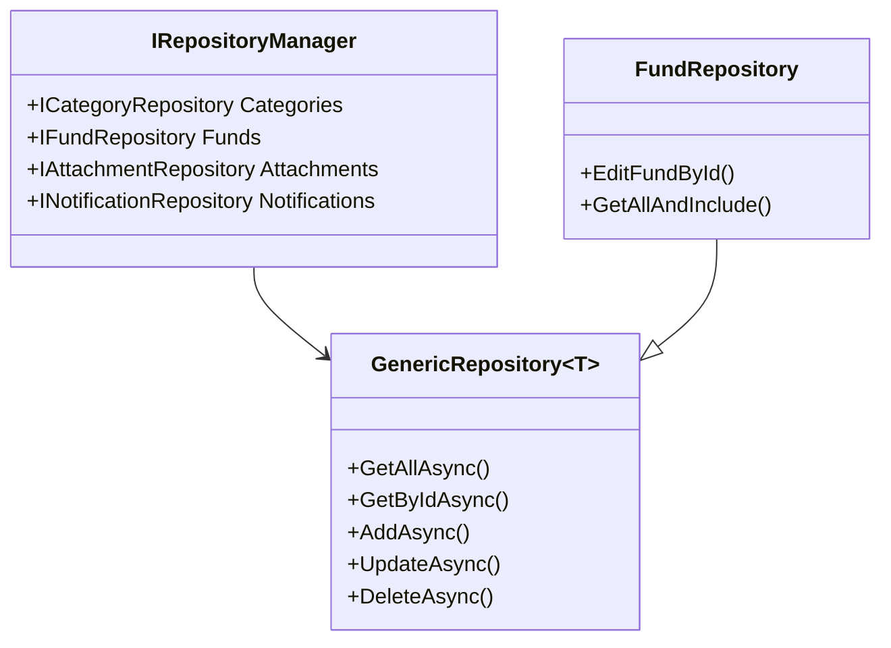

#### 2. State Pattern for Fund Management

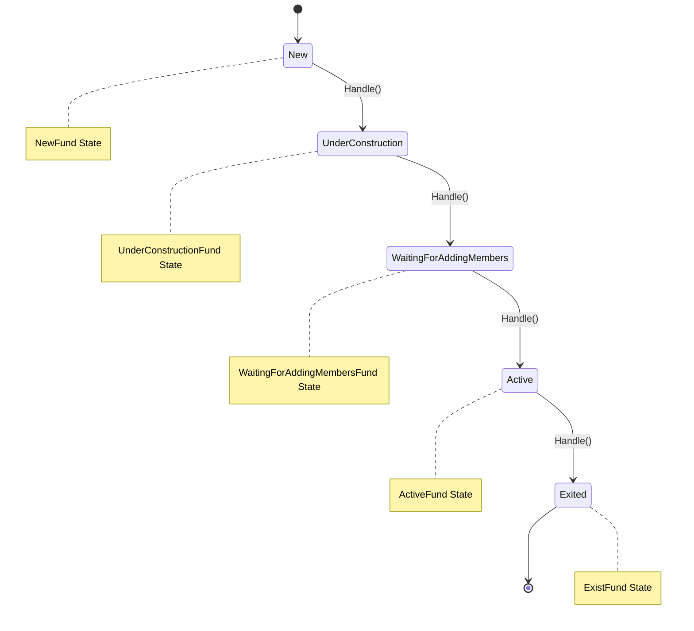

#### 3. Middleware Pipeline

```mermaid
graph LR
    REQ[Request] --> CORS[CORS]
    CORS --> ERR[Error Handler]
    ERR --> AUTH_LOG[Authorization Logging]
    AUTH_LOG --> RATE[Rate Limiting]
    RATE --> CACHE[Response Caching]
    CACHE --> AUTH[Authentication]
    AUTH --> AUTHZ[Authorization]
    AUTHZ --> VAL[Validation]
    VAL --> CTRL[Controller]
    CTRL --> RES[Response]
```

### Service Registration and Dependency Injection

The system uses a modular approach to service registration:

- **Application Services**: MediatR, AutoMapper, FluentValidation
- **Infrastructure Services**: Repositories, Identity, External services
- **Identity Services**: JWT authentication, role-based authorization
- **Background Services**: Notification processing

## Database Design

### Entity Relationship Diagram

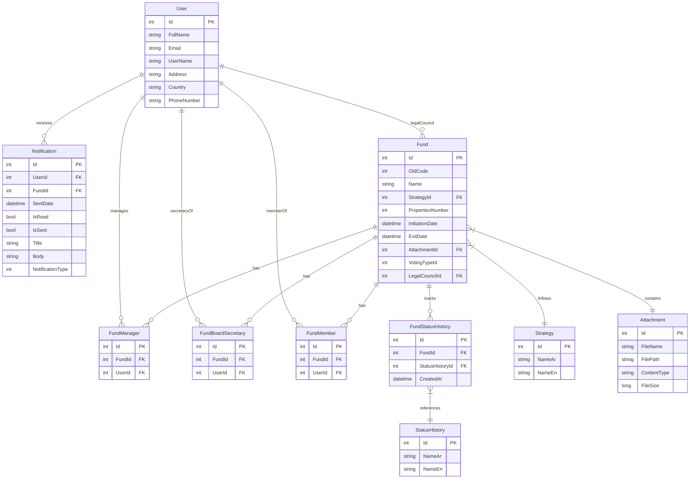

### Database Features

#### 1. Audit Trail
All entities inherit from base audit classes:
- **CreationAuditedEntity**: CreatedAt, CreatedBy
- **AduitedEntity**: UpdatedAt, UpdatedBy
- **FullAuditedEntity**: DeletedAt, DeletedBy, IsDeleted

#### 2. Soft Delete
Entities support soft deletion through the `IsDeleted` flag, maintaining data integrity while hiding deleted records.

#### 3. Multi-language Support
Key entities like `Strategy` and `StatusHistory` support both Arabic (`NameAr`) and English (`NameEn`) names.

## Security Architecture

### Authentication Flow

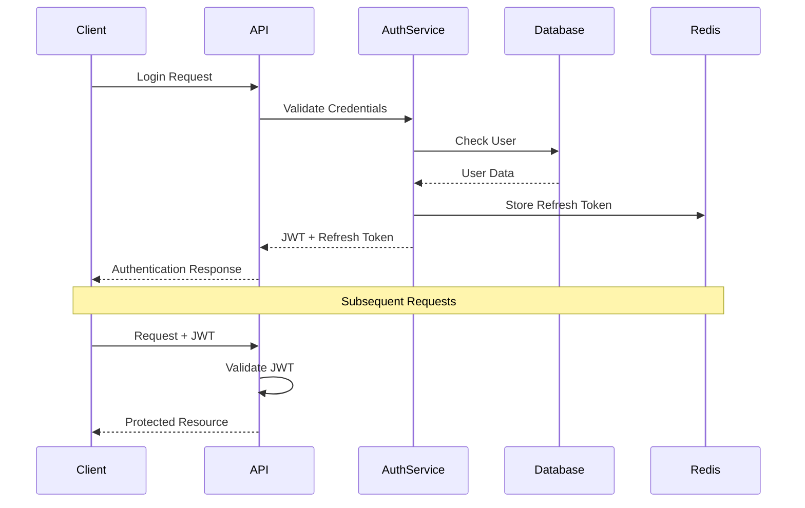

### Authorization Model

#### 1. Role-Based Access Control (RBAC)
- **Roles**: superadmin, admin, user, etc.
- **Claims**: Permission-based authorization
- **Policies**: Dynamic policy creation based on permissions

#### 2. Permission System

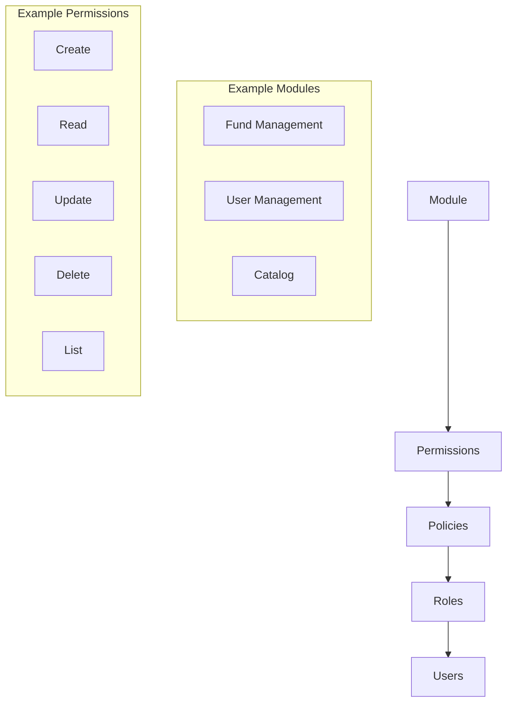

### Security Features

1. **JWT Token Management**
   - Access tokens (short-lived)
   - Refresh tokens (long-lived, stored in Redis)
   - Token validation and refresh mechanism

2. **Password Security**
   - Strong password requirements
   - Account lockout after failed attempts
   - Password hashing with Identity framework

3. **Rate Limiting**
   - IP-based rate limiting (200 requests per minute)
   - Configurable rate limit rules

4. **CORS Configuration**
   - Environment-specific allowed origins
   - Credential support for authenticated requests

## API Design

### RESTful API Structure

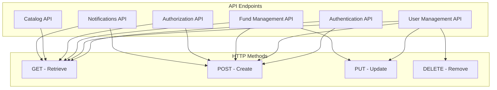

### API Features

1. **Versioning**: API v2 with Swagger documentation
2. **Content Negotiation**: JSON and XML support
3. **Response Caching**: Configurable cache profiles
4. **Pagination**: Built-in pagination support
5. **Validation**: Comprehensive input validation
6. **Error Handling**: Standardized error responses

### Response Format

All API responses follow a consistent format:
```json
{
  "data": {},
  "succeeded": true,
  "message": "Success",
  "errors": [],
  "statusCode": 200
}
```

## Background Services

### Notification Service

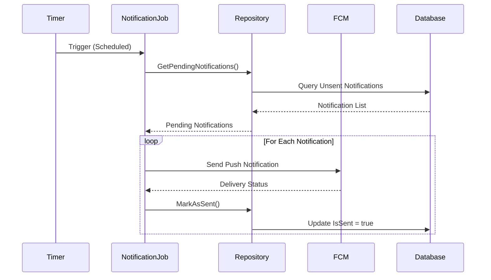

### Background Service Features

1. **FundNotificationJob**: Hosted service for processing fund-related notifications
2. **Firebase Integration**: Push notifications via Firebase Cloud Messaging
3. **Retry Logic**: Built-in retry mechanisms for failed notifications
4. **Logging**: Comprehensive logging for monitoring and debugging

## Technology Stack

### Backend Technologies
- **.NET 8**: Latest LTS version of .NET
- **ASP.NET Core**: Web API framework
- **Entity Framework Core**: ORM for data access
- **MediatR**: CQRS and mediator pattern implementation
- **AutoMapper**: Object-to-object mapping
- **FluentValidation**: Input validation framework
- **NLog**: Logging framework
- **AspNetCoreRateLimit**: Rate limiting middleware

### Database & Caching
- **SQL Server**: Primary database
- **Redis**: Caching and session storage
- **Entity Framework Migrations**: Database versioning

### Authentication & Security
- **ASP.NET Core Identity**: User management
- **JWT Bearer Tokens**: Stateless authentication
- **Role-based Authorization**: Permission system
- **CORS**: Cross-origin resource sharing

### External Integrations
- **Firebase Cloud Messaging**: Push notifications
- **Google APIs**: Firebase integration

### Development Tools
- **Swagger/OpenAPI**: API documentation
- **Docker**: Containerization support
- **Git**: Version control

## Deployment Architecture

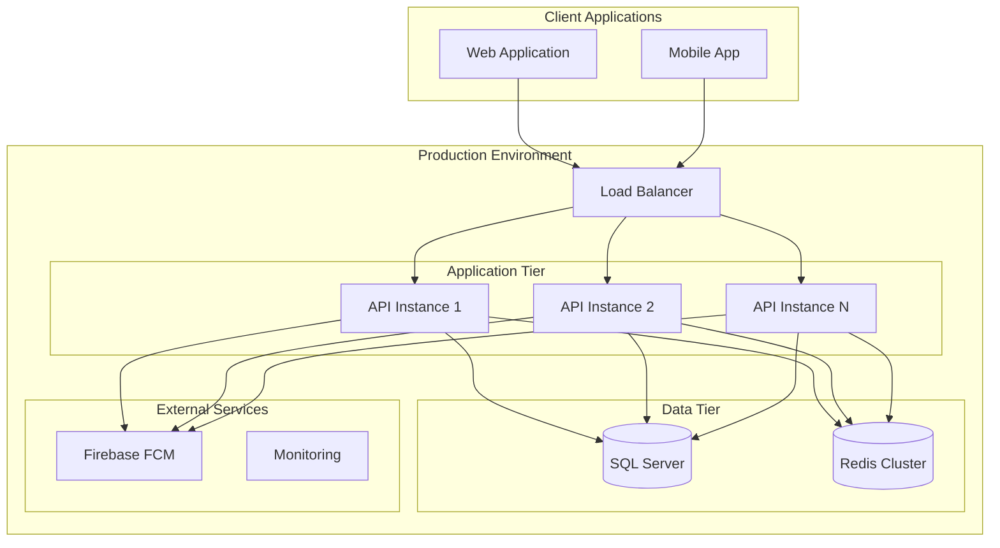

### Environment Configuration

#### Development Environment
- **Database**: Local SQL Server instance
- **Redis**: Local Redis instance
- **CORS**: Localhost:4200 (Angular dev server)
- **Logging**: Debug level logging

#### Production Environment
- **Database**: Production SQL Server cluster
- **Redis**: Redis cluster for high availability
- **CORS**: Production domain (https://jadwa.elmazraah.com)
- **Logging**: Error and warning level logging
- **SSL**: HTTPS enforcement

## Performance Considerations

### Caching Strategy

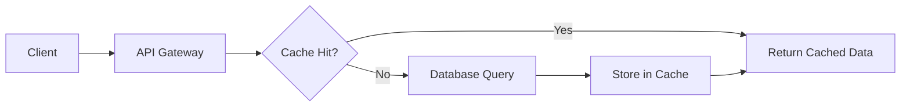

#### Caching Levels
1. **Response Caching**: HTTP response caching with configurable profiles
2. **Memory Caching**: In-memory caching for frequently accessed data
3. **Redis Caching**: Distributed caching for session data and tokens
4. **Database Query Optimization**: EF Core query optimization

### Scalability Features

1. **Stateless Design**: JWT-based authentication enables horizontal scaling
2. **Repository Pattern**: Abstraction layer for easy database switching
3. **CQRS Separation**: Read and write operations can be scaled independently
4. **Background Processing**: Asynchronous notification processing
5. **Rate Limiting**: Prevents system overload

## Monitoring and Logging

### Logging Architecture

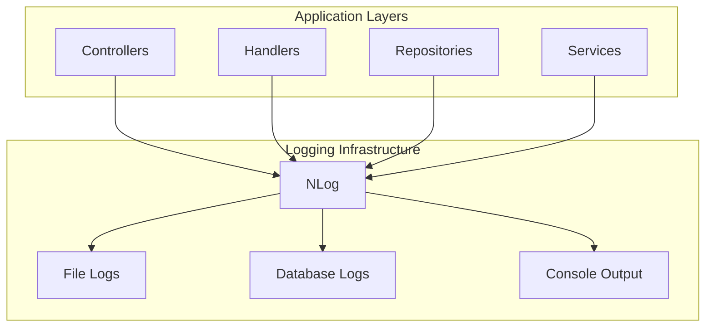

### Monitoring Points

1. **API Performance**: Request/response times and throughput
2. **Database Performance**: Query execution times and connection pooling
3. **Authentication Events**: Login attempts and token validation
4. **Error Tracking**: Exception logging and error rates
5. **Business Metrics**: Fund creation, user activities, notification delivery

## Security Best Practices

### Data Protection

1. **Encryption at Rest**: Database encryption for sensitive data
2. **Encryption in Transit**: HTTPS/TLS for all communications
3. **Token Security**: Secure JWT token generation and validation
4. **Password Security**: Strong password policies and hashing

### Security Headers

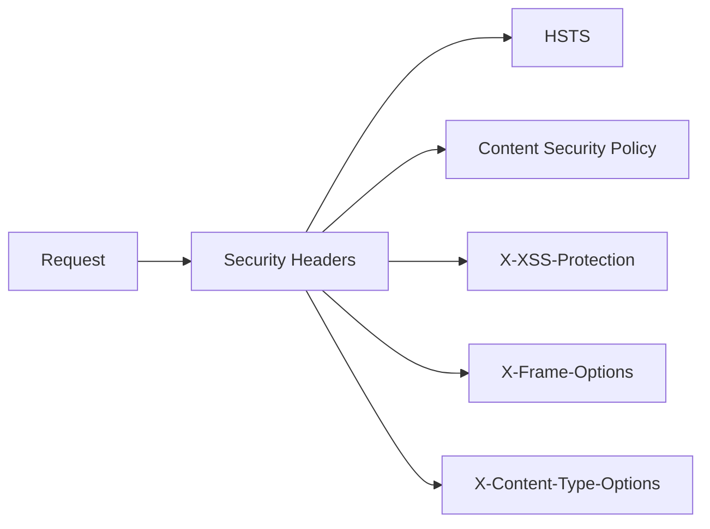

### Audit and Compliance

1. **Audit Trail**: Complete audit logging for all data changes
2. **User Activity Tracking**: Comprehensive user action logging
3. **Data Retention**: Configurable data retention policies
4. **Compliance**: GDPR and local data protection compliance

## Future Enhancements

### Planned Improvements

1. **Microservices Migration**: Breaking down monolith into microservices
2. **Event Sourcing**: Implementing event sourcing for better audit trails
3. **GraphQL**: Adding GraphQL support for flexible data querying
4. **Real-time Features**: WebSocket support for real-time notifications
5. **Advanced Analytics**: Business intelligence and reporting features

### Scalability Roadmap

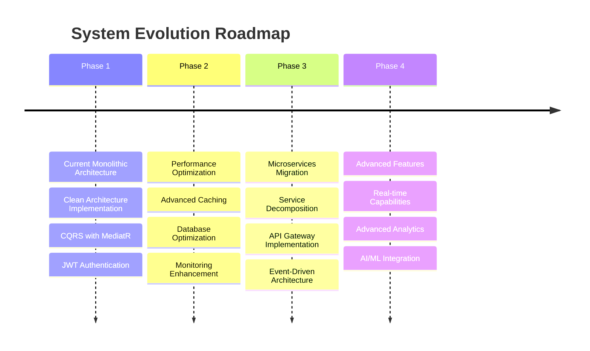

---

## Summary

This comprehensive architecture document provides a complete overview of the Jadwa Fund Management System with **15 integrated Mermaid diagrams** covering:

### 🎯 **Architecture Coverage**
- **High-Level Architecture**: Clean Architecture layers and relationships
- **Low-Level Implementation**: CQRS, Repository patterns, State machines
- **Database Design**: Complete ERD with all entity relationships
- **Security Architecture**: Authentication flows and authorization models
- **API Design**: RESTful endpoints and HTTP methods
- **Background Services**: Notification processing workflows
- **Deployment**: Production environment setup
- **Performance**: Caching strategies and scalability features
- **Monitoring**: Logging architecture and monitoring points
- **Future Roadmap**: Evolution timeline and planned enhancements

### 📊 **Diagram Types Included**
1. **Architecture Overview Diagrams** - System layers and components
2. **Sequence Diagrams** - Process flows and interactions
3. **Class Diagrams** - Design patterns and relationships
4. **State Diagrams** - Business logic state transitions
5. **Entity Relationship Diagrams** - Database schema and relationships
6. **Timeline Diagrams** - Evolution roadmap and phases

### 🔧 **Technical Features**
- **Native Mermaid Integration**: All diagrams render directly in markdown viewers
- **GitHub/GitLab Compatible**: Works with all major Git platforms
- **Documentation Tools**: Compatible with MkDocs, Gitiles, and other tools
- **Professional Quality**: Suitable for technical documentation and presentations

*This enhanced document with integrated Mermaid diagrams provides a comprehensive visual and technical overview of the Jadwa Fund Management System architecture. The diagrams will render automatically in any markdown viewer that supports Mermaid syntax.*
