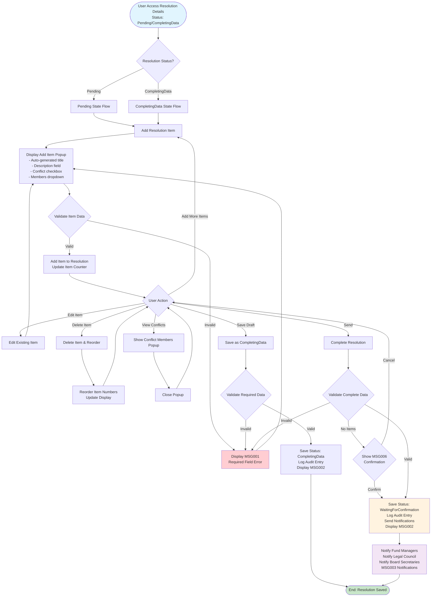
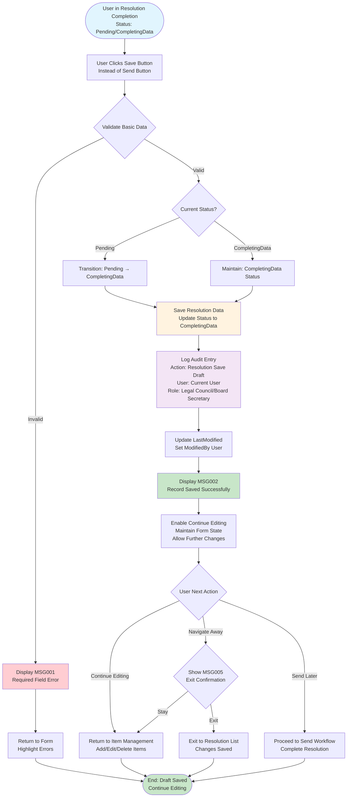

# JDWA-507: Complete Resolution Data Documentation

## Overview

This document provides comprehensive documentation for User Story JDWA-507 "Complete Resolution Data - Resolution Items and Conflicts" in the Jadwa Fund Management System. This user story enables Legal Council and Board Secretary users to complete resolution data by adding resolution items and managing conflict of interest information, transitioning the resolution through the appropriate workflow states.

## Business Context

**User Story**: As a legal council / board secretary, I want to complete the new resolution data; attachments, So that I can go forward in new resolution process.

**Key Stakeholders**:
- **Legal Council**: Can complete resolution data and manage resolution items
- **Board Secretary**: Can complete resolution data and manage resolution items  
- **Fund Manager**: Receives notifications when resolution data is completed

**Business Rules**:
- Resolution must be in "Pending" or "CompletingData" status to be completed
- Resolution items can be added, edited, or deleted during completion
- Conflict of interest members must be specified when conflicts exist
- System validates required data before allowing submission
- Automatic re-ordering of item numbers when items are deleted
- Comprehensive audit logging and notifications for all actions

## State Transitions

The Complete Resolution workflow involves the following state transitions based on the Resolution State Pattern:

- **Pending** → **CompletingData** (Save as Draft)
- **Pending** → **WaitingForConfirmation** (Send for Confirmation)
- **CompletingData** → **CompletingData** (Save as Draft)
- **CompletingData** → **WaitingForConfirmation** (Send for Confirmation)

## Process Flow Diagrams

### 1. Standard Complete Resolution Workflow

This diagram shows the main workflow for completing resolution data with validation, item management, and notifications.



### 2. Alternative 1: Delete Item Workflow

This diagram illustrates the item deletion workflow with automatic reordering functionality.

```mermaid
flowchart TD
    Start([User Views Resolution Items<br/>Multiple Items Present]) --> SelectDelete[User Clicks Delete Button<br/>for Specific Item]
    
    SelectDelete --> ConfirmDelete{Confirm Deletion?}
    ConfirmDelete -->|Cancel| Return[Return to Item List]
    ConfirmDelete -->|Confirm| DeleteItem[Remove Item from List]
    
    DeleteItem --> CheckPosition{Check Item Position}
    CheckPosition -->|First Item| ReorderFromSecond[Reorder Items 2-N<br/>to Items 1-(N-1)]
    CheckPosition -->|Middle Item| ReorderAfter[Reorder Items After<br/>Deleted Position]
    CheckPosition -->|Last Item| NoReorder[No Reordering Needed]
    
    ReorderFromSecond --> UpdateDisplay[Update Item Display<br/>Refresh Item Numbers]
    ReorderAfter --> UpdateDisplay
    NoReorder --> UpdateDisplay
    
    UpdateDisplay --> UpdateCounter[Update Total Item Counter<br/>Adjust Navigation]
    
    UpdateCounter --> CheckRemaining{Any Items Remaining?}
    CheckRemaining -->|Yes| ReturnToActions[Return to Item Actions<br/>Continue Editing]
    CheckRemaining -->|No| EmptyState[Show Empty Items State<br/>Prompt to Add Items]
    
    ReturnToActions --> End([End: Item Deleted<br/>List Updated])
    EmptyState --> End
    Return --> End
    
    style Start fill:#e1f5fe
    style End fill:#c8e6c9
    style DeleteItem fill:#ffcdd2
    style UpdateDisplay fill:#fff3e0
    style ReorderFromSecond fill:#f3e5f5
    style ReorderAfter fill:#f3e5f5
```

### 3. Alternative 3: Save Draft Workflow

This diagram shows the save draft functionality that allows users to save progress without completing the resolution.



## Key Decision Points and Business Rules

### Validation Rules
1. **Required Field Validation**: All mandatory fields must be completed before submission
2. **Item Description**: Maximum 500 characters for item descriptions
3. **Conflict Members**: Must be selected when conflict of interest is checked
4. **Status Validation**: Resolution must be in appropriate status for completion

### State Transition Rules
1. **Pending → CompletingData**: Save as draft functionality
2. **Pending → WaitingForConfirmation**: Direct completion and send
3. **CompletingData → WaitingForConfirmation**: Complete from draft state
4. **Terminal States**: Cannot modify completed, approved, or cancelled resolutions

### User Role Permissions
1. **Legal Council**: Can complete resolution data for any fund they're assigned to
2. **Board Secretary**: Can complete resolution data for funds they manage
3. **Fund Manager**: Receives notifications but cannot complete data
4. **Board Members**: No access to completion functionality

### Notification Rules
1. **MSG003 Notifications**: Sent to all relevant stakeholders when resolution is completed
2. **Recipient Logic**: 
   - Fund Managers attached to the fund
   - Legal Council (if editor is Board Secretary)
   - Board Secretaries (if editor is Legal Council)
3. **Localization**: All notifications support Arabic/English based on user preferences

## Integration Points

### State Pattern Integration
- Utilizes `ResolutionStateContext` for state transitions
- Implements `IResolutionState` interface for status management
- Leverages `ResolutionStateFactory` for state creation and validation

### Audit Trail System
- Comprehensive logging using `ResolutionStatusHistory` entity
- Tracks user actions, timestamps, and state changes
- Supports localized action descriptions for Arabic/English

### Notification System
- Integrates with existing notification infrastructure
- Supports role-based notification routing
- Implements message localization using `SharedResources`

### Clean Architecture Compliance
- Command handlers follow CQRS patterns
- Repository pattern for data access
- Domain entities with business logic encapsulation
- Application services for orchestration

## System Messages

| Message ID | Arabic | English | Type | Usage |
|------------|--------|---------|------|-------|
| MSG001 | حقل إلزامي | Required Field | Error | Validation failures |
| MSG002 | تم حفظ البيانات بنجاح | Record Saved Successfully | Success | Successful operations |
| MSG003 | تم استكمال بيانات القرار | Resolution data completed | Notification | Stakeholder notifications |
| MSG004 | حدث خطأ بالنظام | System error occurred | Error | System failures |
| MSG005 | الخروج من الصفحة يعنى عدم حفظ البيانات | Exit will not save data | Confirmation | Exit confirmations |
| MSG006 | في حالة عدم إضافة بنود القرار سيتم التصويت على القرار ككل | Resolution will be voted as whole without items | Confirmation | No items confirmation |

## Technical Implementation Notes

### Command Handler Structure
- `CompleteResolutionCommandHandler` implements the main workflow
- Validation using FluentValidation with localized messages
- State pattern integration for status management
- Comprehensive error handling and logging

### Entity Relationships
- `Resolution` entity with `ResolutionItems` collection
- `ResolutionItemConflict` for conflict of interest tracking
- `ResolutionStatusHistory` for audit trail
- User and role associations for permissions

### Performance Considerations
- Efficient item reordering algorithms
- Optimized database queries for large item collections
- Caching strategies for frequently accessed data
- Asynchronous notification processing

This documentation provides a comprehensive guide for implementing and understanding the JDWA-507 Complete Resolution functionality within the Jadwa Fund Management System's Clean Architecture framework.
