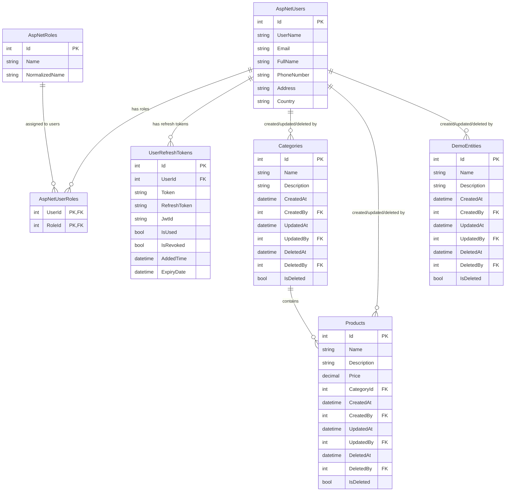

# Jadwa API Database Schema Documentation

## Overview

The Jadwa API uses SQL Server as the primary database with Entity Framework Core as the ORM. The database design follows Domain-Driven Design principles with comprehensive audit trails and soft delete functionality.

## Database Schema

### Core Tables

#### Users Table (ASP.NET Identity)
```sql
CREATE TABLE [dbo].[AspNetUsers] (
    [Id] int IDENTITY(1,1) NOT NULL PRIMARY KEY,
    [UserName] nvarchar(256) NULL,
    [NormalizedUserName] nvarchar(256) NULL,
    [Email] nvarchar(256) NULL,
    [NormalizedEmail] nvarchar(256) NULL,
    [EmailConfirmed] bit NOT NULL,
    [PasswordHash] nvarchar(max) NULL,
    [SecurityStamp] nvarchar(max) NULL,
    [ConcurrencyStamp] nvarchar(max) NULL,
    [PhoneNumber] nvarchar(max) NULL,
    [PhoneNumberConfirmed] bit NOT NULL,
    [TwoFactorEnabled] bit NOT NULL,
    [LockoutEnd] datetimeoffset(7) NULL,
    [LockoutEnabled] bit NOT NULL,
    [AccessFailedCount] int NOT NULL,
    [FullName] nvarchar(max) NOT NULL,
    [Address] nvarchar(max) NULL,
    [Country] nvarchar(max) NULL
);
```

#### Roles Table (ASP.NET Identity)
```sql
CREATE TABLE [dbo].[AspNetRoles] (
    [Id] int IDENTITY(1,1) NOT NULL PRIMARY KEY,
    [Name] nvarchar(256) NULL,
    [NormalizedName] nvarchar(256) NULL,
    [ConcurrencyStamp] nvarchar(max) NULL
);
```

#### UserRefreshTokens Table
```sql
CREATE TABLE [dbo].[UserRefreshTokens] (
    [Id] int IDENTITY(1,1) NOT NULL PRIMARY KEY,
    [UserId] int NOT NULL,
    [Token] nvarchar(max) NOT NULL,
    [RefreshToken] nvarchar(max) NOT NULL,
    [JwtId] nvarchar(max) NULL,
    [IsUsed] bit NOT NULL,
    [IsRevoked] bit NOT NULL,
    [AddedTime] datetime2(7) NOT NULL,
    [ExpiryDate] datetime2(7) NOT NULL,
    CONSTRAINT [FK_UserRefreshTokens_AspNetUsers_UserId] 
        FOREIGN KEY ([UserId]) REFERENCES [dbo].[AspNetUsers] ([Id]) ON DELETE CASCADE
);
```

#### Categories Table
```sql
CREATE TABLE [dbo].[Categories] (
    [Id] int IDENTITY(1,1) NOT NULL PRIMARY KEY,
    [Name] nvarchar(max) NOT NULL,
    [Description] nvarchar(max) NOT NULL,
    [CreatedAt] datetime2(7) NOT NULL,
    [CreatedBy] int NOT NULL,
    [UpdatedAt] datetime2(7) NULL,
    [UpdatedBy] int NULL,
    [DeletedAt] datetime2(7) NULL,
    [IsDeleted] bit NULL,
    [DeletedBy] int NULL,
    CONSTRAINT [FK_Categories_AspNetUsers_CreatedBy] 
        FOREIGN KEY ([CreatedBy]) REFERENCES [dbo].[AspNetUsers] ([Id]) ON DELETE RESTRICT,
    CONSTRAINT [FK_Categories_AspNetUsers_UpdatedBy] 
        FOREIGN KEY ([UpdatedBy]) REFERENCES [dbo].[AspNetUsers] ([Id]) ON DELETE RESTRICT,
    CONSTRAINT [FK_Categories_AspNetUsers_DeletedBy] 
        FOREIGN KEY ([DeletedBy]) REFERENCES [dbo].[AspNetUsers] ([Id]) ON DELETE RESTRICT
);
```

#### Products Table
```sql
CREATE TABLE [dbo].[Products] (
    [Id] int IDENTITY(1,1) NOT NULL PRIMARY KEY,
    [Name] nvarchar(max) NOT NULL,
    [Description] nvarchar(max) NOT NULL,
    [Price] decimal(18,2) NOT NULL,
    [CategoryId] int NOT NULL,
    [CreatedAt] datetime2(7) NOT NULL,
    [CreatedBy] int NOT NULL,
    [UpdatedAt] datetime2(7) NULL,
    [UpdatedBy] int NULL,
    [DeletedAt] datetime2(7) NULL,
    [IsDeleted] bit NULL,
    [DeletedBy] int NULL,
    CONSTRAINT [FK_Products_Categories_CategoryId] 
        FOREIGN KEY ([CategoryId]) REFERENCES [dbo].[Categories] ([Id]) ON DELETE RESTRICT,
    CONSTRAINT [FK_Products_AspNetUsers_CreatedBy] 
        FOREIGN KEY ([CreatedBy]) REFERENCES [dbo].[AspNetUsers] ([Id]) ON DELETE RESTRICT,
    CONSTRAINT [FK_Products_AspNetUsers_UpdatedBy] 
        FOREIGN KEY ([UpdatedBy]) REFERENCES [dbo].[AspNetUsers] ([Id]) ON DELETE RESTRICT,
    CONSTRAINT [FK_Products_AspNetUsers_DeletedBy] 
        FOREIGN KEY ([DeletedBy]) REFERENCES [dbo].[AspNetUsers] ([Id]) ON DELETE RESTRICT
);
```

#### DemoEntities Table
```sql
CREATE TABLE [dbo].[DemoEntities] (
    [Id] int IDENTITY(1,1) NOT NULL PRIMARY KEY,
    [Name] nvarchar(max) NOT NULL,
    [Description] nvarchar(max) NOT NULL,
    [CreatedAt] datetime2(7) NOT NULL,
    [CreatedBy] int NOT NULL,
    [UpdatedAt] datetime2(7) NULL,
    [UpdatedBy] int NULL,
    [DeletedAt] datetime2(7) NULL,
    [IsDeleted] bit NULL,
    [DeletedBy] int NULL,
    CONSTRAINT [FK_DemoEntities_AspNetUsers_CreatedBy] 
        FOREIGN KEY ([CreatedBy]) REFERENCES [dbo].[AspNetUsers] ([Id]) ON DELETE RESTRICT,
    CONSTRAINT [FK_DemoEntities_AspNetUsers_UpdatedBy] 
        FOREIGN KEY ([UpdatedBy]) REFERENCES [dbo].[AspNetUsers] ([Id]) ON DELETE RESTRICT,
    CONSTRAINT [FK_DemoEntities_AspNetUsers_DeletedBy] 
        FOREIGN KEY ([DeletedBy]) REFERENCES [dbo].[AspNetUsers] ([Id]) ON DELETE RESTRICT
);
```

## Entity Relationships

### Primary Relationships

<div align="center">



</div>

## Audit Trail Implementation

### Base Entity Hierarchy

The database implements a comprehensive audit trail system through entity inheritance:

1. **BaseEntity**: Contains only the primary key (Id)
2. **CreationAuditedEntity**: Adds creation tracking (CreatedAt, CreatedBy)
3. **AuditedEntity**: Adds update tracking (UpdatedAt, UpdatedBy)
4. **FullAuditedEntity**: Adds soft delete tracking (DeletedAt, DeletedBy, IsDeleted)

### Audit Fields Description

| Field | Type | Description |
|-------|------|-------------|
| CreatedAt | datetime2(7) | Timestamp when the record was created |
| CreatedBy | int | Foreign key to the user who created the record |
| UpdatedAt | datetime2(7) | Timestamp when the record was last updated |
| UpdatedBy | int | Foreign key to the user who last updated the record |
| DeletedAt | datetime2(7) | Timestamp when the record was soft deleted |
| DeletedBy | int | Foreign key to the user who deleted the record |
| IsDeleted | bit | Flag indicating if the record is soft deleted |

## Indexes and Performance

### Recommended Indexes

```sql
-- Performance indexes for common queries
CREATE INDEX IX_Products_CategoryId ON Products(CategoryId);
CREATE INDEX IX_Products_CreatedBy ON Products(CreatedBy);
CREATE INDEX IX_Products_IsDeleted ON Products(IsDeleted);

CREATE INDEX IX_Categories_CreatedBy ON Categories(CreatedBy);
CREATE INDEX IX_Categories_IsDeleted ON Categories(IsDeleted);

CREATE INDEX IX_UserRefreshTokens_UserId ON UserRefreshTokens(UserId);
CREATE INDEX IX_UserRefreshTokens_Token ON UserRefreshTokens(Token);
CREATE INDEX IX_UserRefreshTokens_RefreshToken ON UserRefreshTokens(RefreshToken);
CREATE INDEX IX_UserRefreshTokens_ExpiryDate ON UserRefreshTokens(ExpiryDate);

-- Composite indexes for audit queries
CREATE INDEX IX_Products_CreatedAt_IsDeleted ON Products(CreatedAt, IsDeleted);
CREATE INDEX IX_Categories_CreatedAt_IsDeleted ON Categories(CreatedAt, IsDeleted);
```

## Data Seeding

### Default Roles
The system seeds three default roles:
- **superadmin**: Full system access
- **admin**: Administrative access to catalog management
- **basic**: Basic user access with read permissions

### Seed Configuration
```csharp
// Role seeding in RoleConfig.cs
await roleManager.CreateAsync(new Role() { Name = "superadmin" });
await roleManager.CreateAsync(new Role() { Name = "admin" });
await roleManager.CreateAsync(new Role() { Name = "basic" });
```

## Connection Strings

### Development Environment
```json
{
  "ConnectionStrings": {
    "default": "Server=./; Database=Jadwa; User=sa; Password=123456;MultipleActiveResultSets=true;TrustServerCertificate=true",
    "Redis": "localhost:6379"
  }
}
```

### Production Environment
```json
{
  "ConnectionStrings": {
    "default": "Server=157.180.30.149; Database=Jadwa; User=sa; Password=28nX83F5gVJ1;MultipleActiveResultSets=true;TrustServerCertificate=true",
    "Redis": "localhost:6379"
  }
}
```

## Migration Strategy

### Entity Framework Migrations
The project uses Entity Framework Core migrations for database schema management:

```bash
# Add new migration
dotnet ef migrations add MigrationName --project Infrastructure

# Update database
dotnet ef database update --project Infrastructure

# Generate SQL script
dotnet ef migrations script --project Infrastructure
```

### Migration Assembly Configuration
```csharp
services.AddDbContext<AppDbContext>(options => 
    options.UseSqlServer(connectionString, 
        builder => builder.MigrationsAssembly(typeof(AppDbContext).Assembly.FullName)));
```
