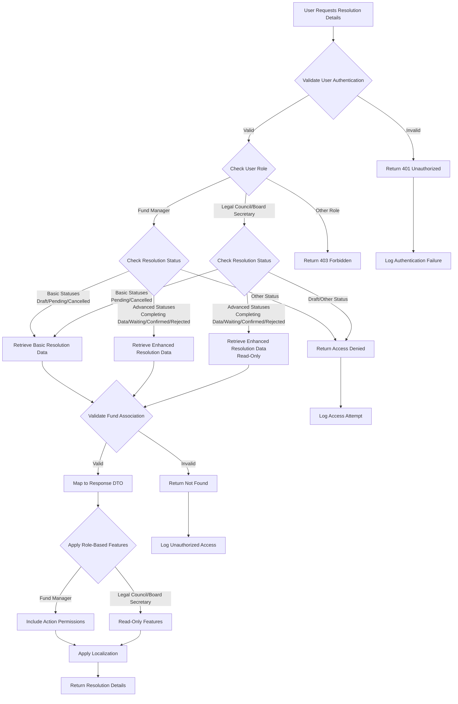
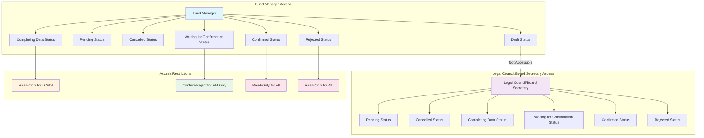

# Jadwa Fund Management System - View Resolution Details User Stories Documentation

**Version:** 1.0  
**Created:** December 26, 2025  
**User Stories:** JDWA-588, JDWA-589, JDWA-593, JDWA-584  
**Domain:** Resolution Management - View Details Operations  

## Overview

This document provides comprehensive technical documentation for four user stories focused on viewing resolution details across different user roles and resolution statuses. These stories implement role-based access control for resolution viewing functionality following Clean Architecture and CQRS patterns.

## User Stories Summary

| Story ID | Title | User Role | Resolution Statuses | Priority |
|----------|-------|-----------|-------------------|----------|
| JDWA-588 | View draft/pending/cancelled resolution details | Fund Manager | Draft, Pending, Cancelled | High |
| JDWA-584 | View pending&cancelled resolution details | Legal Council/Board Secretary | Pending, Cancelled | High |
| JDWA-593 | View completing data & waiting for confirmation & confirmed & rejected resolution details | Fund Manager | Completing Data, Waiting for Confirmation, Confirmed, Rejected | Medium |
| JDWA-589 | View completing data & waiting for confirmation & confirmed & rejected resolution details | Legal Council/Board Secretary | Completing Data, Waiting for Confirmation, Confirmed, Rejected | Medium |

---

## JDWA-588: View Draft/Pending/Cancelled Resolution Details - Fund Manager

### 1. Story Overview
As a fund manager, I want to be able to view draft/pending/cancelled resolution details, so that I can track my resolution details and manage the resolution lifecycle effectively.

### 2. Technical Requirements

#### Query Implementation
- **Query Class**: `GetResolutionQuery` (existing)
- **Handler**: `GetResolutionQueryHandler` (existing - enhance for role-based filtering)
- **Response DTO**: `SingleResolutionResponse` (existing)
- **Controller Endpoint**: `GET /api/resolutions/{id}/details`

#### Data Access
- Repository method: `GetResolutionWithAllDataAsync(int id, bool trackChanges = false)`
- Include related entities: Fund, ResolutionType, Attachment, ResolutionItems, ResolutionStatusHistories
- Apply role-based filtering for Fund Manager access

### 3. Business Rules

#### Status Access Rules
- Fund Manager can view resolutions with statuses: Draft, Pending, Cancelled
- Must be associated with funds where user has Fund Manager role
- Cannot view resolutions in other statuses (Completing Data, Waiting for Confirmation, etc.)

#### Data Visibility Rules
- **Basic Info**: All fields visible (Code, Date, Description, Type, File, Voting Methodology, Status)
- **Attachments**: View only (no download restrictions)
- **Resolution Items**: View items and conflict information
- **History**: View creation and status change history

### 4. RBAC Considerations

#### Permissions Required
- `ResolutionPermission.View` - Base permission for viewing resolutions
- Fund association validation through `ICurrentUserService`

#### Role Validation
```csharp
// Validate user has Fund Manager role for the fund
var userFunds = await _repository.Funds.GetFundsByUserRoleAsync(currentUserId, "Fund Manager");
var hasAccess = userFunds.Any(f => f.Id == resolution.FundId);
```

### 5. Localization Requirements

#### Localized Fields
- Resolution Type display names (Arabic/English)
- Status display names using `ResolutionStatusDisplayResolver`
- Error messages using `SharedResourcesKey.ResolutionNotFound`
- Voting methodology labels

#### Resource Keys
```csharp
SharedResourcesKey.ResolutionNotFound = "Resolution not found"
SharedResourcesKey.UnauthorizedAccess = "Unauthorized access to resolution"
SharedResourcesKey.SystemError = "An error occurred while displaying data"
```

### 6. State Management
- No state transitions required (read-only operation)
- State validation to ensure only allowed statuses are accessible
- Use existing State Pattern for status validation

### 7. Dependencies
- **Entities**: Resolution, Fund, ResolutionType, ResolutionAttachment
- **Services**: ICurrentUserService, IRepositoryManager
- **Related Stories**: JDWA-511 (Create Resolution), JDWA-509 (Edit Resolution)

### 8. Implementation Approach

#### Controller Enhancement
```csharp
[Authorize(Policy = ResolutionPermission.View)]
[HttpGet("{id}/details")]
public async Task<IActionResult> GetResolutionDetails(int id)
{
    var query = new GetResolutionQuery { Id = id };
    var response = await Mediator.Send(query);
    return Ok(response);
}
```

#### Query Handler Enhancement
- Enhance existing `GetQueryHandler` with role-based status filtering
- Add validation for Fund Manager specific statuses
- Implement comprehensive error handling with localized messages

### 9. Acceptance Criteria

#### Scenario 1: Successful Resolution Display
- **Given**: Fund Manager is authenticated and has access to a fund
- **When**: User clicks "details" for a draft/pending/cancelled resolution
- **Then**: Resolution details are displayed with all relevant information

#### Scenario 2: Unauthorized Access
- **Given**: Fund Manager tries to access resolution from different fund
- **When**: User attempts to view resolution details
- **Then**: Unauthorized access error is displayed

#### Scenario 3: Invalid Status Access
- **Given**: Fund Manager tries to view resolution with status "Completing Data"
- **When**: User attempts to view resolution details
- **Then**: Access denied error is displayed

#### Scenario 4: System Error Handling
- **Given**: Database connection issue occurs
- **When**: User attempts to view resolution details
- **Then**: System error message (MSG001) is displayed

---

## JDWA-584: View Pending&Cancelled Resolution Details - Legal Council/Board Secretary

### 1. Story Overview
As a legal council/board secretary, I want to be able to view pending & cancelled resolution details, so that I can track resolution details and perform my review responsibilities.

### 2. Technical Requirements

#### Query Implementation
- **Query Class**: `GetResolutionQuery` (existing)
- **Handler**: `GetResolutionQueryHandler` (enhance for Legal Council/Board Secretary role)
- **Response DTO**: `SingleResolutionResponse` (existing)
- **Controller Endpoint**: `GET /api/resolutions/{id}/details`

#### Role-Specific Data Access
- Repository filtering for Legal Council/Board Secretary roles
- Include additional fields for review purposes
- Access to resolution items and conflict information

### 3. Business Rules

#### Status Access Rules
- Legal Council/Board Secretary can view resolutions with statuses: Pending, Cancelled
- Must be associated with funds where user has Legal Council or Board Secretary role
- Cannot view Draft resolutions (Fund Manager exclusive)

#### Review Capabilities
- View resolution basic information
- Access to resolution file and attachments
- Review resolution items and member conflicts
- View resolution history for audit trail

### 4. RBAC Considerations

#### Permissions Required
- `ResolutionPermission.View` - Base permission
- Role validation for Legal Council or Board Secretary

#### Role Validation Logic
```csharp
var allowedRoles = new[] { "Legal Council", "Board Secretary" };
var userRoles = _currentUserService.Roles;
var hasValidRole = allowedRoles.Any(role => userRoles.Contains(role));
```

### 5. Localization Requirements
- Same localization requirements as JDWA-588
- Additional review-specific terminology
- Status-specific messages for Pending and Cancelled states

### 6. State Management
- Read-only access with no state transitions
- Validation for Pending and Cancelled status access only

### 7. Dependencies
- Same core dependencies as JDWA-588
- Additional validation for Legal Council/Board Secretary roles

### 8. Implementation Approach

#### Enhanced Role-Based Filtering
```csharp
// In GetQueryHandler
var allowedStatuses = new[] { ResolutionStatusEnum.Pending, ResolutionStatusEnum.Cancelled };
if (!allowedStatuses.Contains(resolution.Status))
{
    return Unauthorized<SingleResolutionResponse>(_localizer[SharedResourcesKey.UnauthorizedAccess]);
}
```

### 9. Acceptance Criteria

#### Scenario 1: Successful Pending Resolution Display
- **Given**: Legal Council is authenticated and associated with fund
- **When**: User clicks "details" for a pending resolution
- **Then**: Resolution details are displayed with review information

#### Scenario 2: Successful Cancelled Resolution Display
- **Given**: Board Secretary is authenticated and associated with fund
- **When**: User clicks "details" for a cancelled resolution
- **Then**: Resolution details are displayed with cancellation history

#### Scenario 3: Draft Resolution Access Denied
- **Given**: Legal Council tries to access a draft resolution
- **When**: User attempts to view resolution details
- **Then**: Access denied error is displayed

---

## JDWA-593: View Completing Data & Waiting for Confirmation & Confirmed & Rejected Resolution Details - Fund Manager

### 1. Story Overview
As a fund manager, I want to view resolution details of completing data & waiting for confirmation & confirmed & rejected resolution, so that I can go forward in the resolution process and track advanced resolution states.

### 2. Technical Requirements

#### Enhanced Query Implementation
- **Query Class**: `GetResolutionQuery` (existing - enhance for advanced statuses)
- **Handler**: `GetResolutionQueryHandler` (enhance for Fund Manager advanced access)
- **Response DTO**: `SingleResolutionResponse` (enhance with additional fields)
- **Controller Endpoint**: `GET /api/resolutions/{id}/details`

#### Advanced Data Access
- Include ResolutionItems with conflict information
- Include ResolutionAttachments collection
- Include comprehensive ResolutionStatusHistory
- Include rejection reasons for rejected resolutions
- Include parent resolution information for referral resolutions

### 3. Business Rules

#### Status Access Rules
- Fund Manager can view resolutions with statuses: Completing Data, Waiting for Confirmation, Confirmed, Rejected
- Must be associated with funds where user has Fund Manager role
- Can view all resolution data including items, attachments, and history

#### Advanced Features Access
- **Confirm/Reject Actions**: Available for "Waiting for Confirmation" status
- **Download Attachments**: Full access to all resolution files
- **View Resolution Items**: Including conflict of interest information
- **Resolution History**: Complete audit trail with action details

### 4. RBAC Considerations

#### Permissions Required
- `ResolutionPermission.View` - Base viewing permission
- `ResolutionPermission.Confirm` - For confirm/reject actions (Waiting for Confirmation status)
- Fund Manager role validation

#### Action-Based Permissions
```csharp
// For Waiting for Confirmation status
if (resolution.Status == ResolutionStatusEnum.WaitingForConfirmation)
{
    response.CanConfirm = await _authorizationService.AuthorizeAsync(user, ResolutionPermission.Confirm);
    response.CanReject = await _authorizationService.AuthorizeAsync(user, ResolutionPermission.Reject);
}
```

### 5. Localization Requirements

#### Enhanced Localized Fields
- Advanced status display names
- Action button labels (Confirm/Reject)
- Resolution history action names
- Rejection reason labels
- Parent resolution references

#### Additional Resource Keys
```csharp
SharedResourcesKey.ConfirmResolution = "Confirm Resolution"
SharedResourcesKey.RejectResolution = "Reject Resolution"
SharedResourcesKey.ResolutionHistory = "Resolution History"
SharedResourcesKey.RejectionReason = "Rejection Reason"
SharedResourcesKey.ParentResolution = "Parent Resolution"
```

### 6. State Management

#### State Validation
- Validate access to advanced statuses
- Ensure proper state transitions are available
- Display available actions based on current state

#### State-Specific Features
```csharp
switch (resolution.Status)
{
    case ResolutionStatusEnum.CompletingData:
        // Read-only access, show completion progress
        break;
    case ResolutionStatusEnum.WaitingForConfirmation:
        // Show confirm/reject actions
        break;
    case ResolutionStatusEnum.Confirmed:
        // Show confirmation details and next steps
        break;
    case ResolutionStatusEnum.Rejected:
        // Show rejection reason and history
        break;
}
```

### 7. Dependencies
- **Enhanced Entities**: Resolution with Items, Attachments, StatusHistory
- **Services**: ICurrentUserService, IAuthorizationService
- **Related Stories**: JDWA-506 (Complete Resolution Data), JDWA-567 (Edit Resolution Data)

### 8. Implementation Approach

#### Enhanced Response DTO
```csharp
public record SingleResolutionResponse : ResolutionDto
{
    // Existing properties...

    // Advanced status properties
    public List<ResolutionItemDto> ResolutionItems { get; set; } = new();
    public List<ResolutionAttachmentDto> Attachments { get; set; } = new();
    public List<ResolutionHistoryDto> StatusHistory { get; set; } = new();
    public string? RejectionReason { get; set; }
    public string? ParentResolutionCode { get; set; }

    // Action availability
    public bool CanConfirm { get; set; }
    public bool CanReject { get; set; }
}
```

### 9. Acceptance Criteria

#### Scenario 1: View Completing Data Resolution
- **Given**: Fund Manager accesses resolution with "Completing Data" status
- **When**: User clicks "details"
- **Then**: Resolution details are displayed with completion progress

#### Scenario 2: View Waiting for Confirmation Resolution
- **Given**: Fund Manager accesses resolution with "Waiting for Confirmation" status
- **When**: User clicks "details"
- **Then**: Resolution details are displayed with Confirm/Reject actions

#### Scenario 3: View Confirmed Resolution
- **Given**: Fund Manager accesses confirmed resolution
- **When**: User clicks "details"
- **Then**: Resolution details are displayed with confirmation history

#### Scenario 4: View Rejected Resolution
- **Given**: Fund Manager accesses rejected resolution
- **When**: User clicks "details"
- **Then**: Resolution details are displayed with rejection reason

---

## JDWA-589: View Completing Data & Waiting for Confirmation & Confirmed & Rejected Resolution Details - Legal Council/Board Secretary

### 1. Story Overview
As a legal council/board secretary, I want to be able to view completing data & waiting for confirmation & confirmed & rejected resolution details, so that I can go forward in the resolution process and fulfill my review responsibilities.

### 2. Technical Requirements

#### Role-Specific Implementation
- **Query Class**: `GetResolutionQuery` (existing)
- **Handler**: `GetResolutionQueryHandler` (enhance for Legal Council/Board Secretary advanced access)
- **Response DTO**: `SingleResolutionResponse` (same as JDWA-593)
- **Controller Endpoint**: `GET /api/resolutions/{id}/details`

#### Legal Council/Board Secretary Data Access
- Full access to resolution items and attachments
- Complete resolution history for audit purposes
- Access to rejection reasons and parent resolution information
- Review capabilities for all advanced statuses

### 3. Business Rules

#### Status Access Rules
- Legal Council/Board Secretary can view resolutions with statuses: Completing Data, Waiting for Confirmation, Confirmed, Rejected
- Must be associated with funds where user has Legal Council or Board Secretary role
- Cannot perform confirm/reject actions (Fund Manager exclusive)

#### Review-Specific Features
- **Read-Only Access**: No state-changing actions available
- **Complete Data Review**: Access to all resolution information
- **Audit Trail**: Full history and action tracking
- **Document Access**: Download and view all attachments

### 4. RBAC Considerations

#### Permissions Required
- `ResolutionPermission.View` - Base viewing permission
- Legal Council or Board Secretary role validation
- No action permissions (confirm/reject not available)

#### Role-Based Feature Restrictions
```csharp
// Legal Council/Board Secretary cannot perform actions
response.CanConfirm = false;
response.CanReject = false;
response.CanEdit = false; // Based on status and role
```

### 5. Localization Requirements
- Same localization requirements as JDWA-593
- Additional review-specific terminology
- Role-appropriate action labels

### 6. State Management
- Read-only access to all advanced statuses
- No state transitions available
- Status validation for Legal Council/Board Secretary access

### 7. Dependencies
- Same dependencies as JDWA-593
- Additional role validation logic

### 8. Implementation Approach

#### Role-Based Access Control
```csharp
// In GetQueryHandler
var allowedStatuses = new[]
{
    ResolutionStatusEnum.CompletingData,
    ResolutionStatusEnum.WaitingForConfirmation,
    ResolutionStatusEnum.Confirmed,
    ResolutionStatusEnum.Rejected
};

var allowedRoles = new[] { "Legal Council", "Board Secretary" };
var userRoles = _currentUserService.Roles;

if (!allowedRoles.Any(role => userRoles.Contains(role)) ||
    !allowedStatuses.Contains(resolution.Status))
{
    return Unauthorized<SingleResolutionResponse>(_localizer[SharedResourcesKey.UnauthorizedAccess]);
}
```

### 9. Acceptance Criteria

#### Scenario 1: View Completing Data Resolution
- **Given**: Legal Council accesses resolution with "Completing Data" status
- **When**: User clicks "details"
- **Then**: Resolution details are displayed with read-only access

#### Scenario 2: View Waiting for Confirmation Resolution
- **Given**: Board Secretary accesses resolution with "Waiting for Confirmation" status
- **When**: User clicks "details"
- **Then**: Resolution details are displayed without action buttons

#### Scenario 3: View Confirmed Resolution
- **Given**: Legal Council accesses confirmed resolution
- **When**: User clicks "details"
- **Then**: Resolution details are displayed with complete history

#### Scenario 4: View Rejected Resolution
- **Given**: Board Secretary accesses rejected resolution
- **When**: User clicks "details"
- **Then**: Resolution details are displayed with rejection information

---

## Mermaid Diagrams

### Resolution Details Access Flow



### Role-Based Status Access Matrix



### Resolution Status Progression

```mermaid
stateDiagram-v2
    [*] --> Draft
    Draft --> Pending : Send for Review
    Draft --> Cancelled : Cancel

    Pending --> CompletingData : Legal Council/Board Secretary Starts Completion
    Pending --> Cancelled : Fund Manager Cancels

    CompletingData --> WaitingForConfirmation : Complete Data

    WaitingForConfirmation --> Confirmed : Fund Manager Confirms
    WaitingForConfirmation --> Rejected : Fund Manager Rejects
    WaitingForConfirmation --> CompletingData : Edit Data (Suspend)

    Confirmed --> [*]
    Rejected --> [*]
    Cancelled --> [*]

    note right of Draft
        JDWA-588: FM can view
    end note

    note right of Pending
        JDWA-588: FM can view
        JDWA-584: LC/BS can view
    end note

    note right of CompletingData
        JDWA-593: FM can view
        JDWA-589: LC/BS can view
    end note

    note right of WaitingForConfirmation
        JDWA-593: FM can view & act
        JDWA-589: LC/BS can view only
    end note

---

## Implementation Strategy

### Phase 1: Core Infrastructure Enhancement (Week 1)

#### 1.1 Enhanced Query Handler
- Extend existing `GetQueryHandler` with role-based status filtering
- Implement advanced data loading for enhanced statuses
- Add comprehensive error handling with localized messages

#### 1.2 Response DTO Enhancement
```csharp
public record SingleResolutionResponse : ResolutionDto
{
    // Basic properties (existing)
    public string Code { get; set; } = string.Empty;
    public DateTime ResolutionDate { get; set; }
    public string Description { get; set; } = string.Empty;
    public string StatusDisplay { get; set; } = string.Empty;

    // Enhanced properties for advanced statuses
    public List<ResolutionItemDto> ResolutionItems { get; set; } = new();
    public List<ResolutionAttachmentDto> Attachments { get; set; } = new();
    public List<ResolutionHistoryDto> StatusHistory { get; set; } = new();
    public string? RejectionReason { get; set; }
    public string? ParentResolutionCode { get; set; }

    // Role-based action availability
    public bool CanConfirm { get; set; }
    public bool CanReject { get; set; }
    public bool CanEdit { get; set; }
    public bool CanDownloadAttachments { get; set; } = true;
}
```

#### 1.3 Repository Method Enhancement
```csharp
public async Task<Resolution?> GetResolutionWithAllDataAsync(int id, bool trackChanges = false)
{
    return await FindByCondition(r => r.Id == id, trackChanges)
        .Include(r => r.Fund)
        .Include(r => r.ResolutionType)
        .Include(r => r.Attachment)
        .Include(r => r.ResolutionItems)
            .ThenInclude(ri => ri.ResolutionItemConflicts)
            .ThenInclude(ric => ric.BoardMember)
        .Include(r => r.ResolutionStatusHistories)
            .ThenInclude(rsh => rsh.ResolutionStatus)
        .Include(r => r.ParentResolution)
        .FirstOrDefaultAsync();
}
```

### Phase 2: Role-Based Access Control Implementation (Week 2)

#### 2.1 Status Access Validation
```csharp
private static readonly Dictionary<string, ResolutionStatusEnum[]> RoleStatusAccess = new()
{
    ["Fund Manager"] = new[]
    {
        ResolutionStatusEnum.Draft,
        ResolutionStatusEnum.Pending,
        ResolutionStatusEnum.Cancelled,
        ResolutionStatusEnum.CompletingData,
        ResolutionStatusEnum.WaitingForConfirmation,
        ResolutionStatusEnum.Confirmed,
        ResolutionStatusEnum.Rejected
    },
    ["Legal Council"] = new[]
    {
        ResolutionStatusEnum.Pending,
        ResolutionStatusEnum.Cancelled,
        ResolutionStatusEnum.CompletingData,
        ResolutionStatusEnum.WaitingForConfirmation,
        ResolutionStatusEnum.Confirmed,
        ResolutionStatusEnum.Rejected
    },
    ["Board Secretary"] = new[]
    {
        ResolutionStatusEnum.Pending,
        ResolutionStatusEnum.Cancelled,
        ResolutionStatusEnum.CompletingData,
        ResolutionStatusEnum.WaitingForConfirmation,
        ResolutionStatusEnum.Confirmed,
        ResolutionStatusEnum.Rejected
    }
};
```

#### 2.2 Action Permission Logic
```csharp
private void SetActionPermissions(SingleResolutionResponse response, Resolution resolution, IList<string> userRoles)
{
    var isFundManager = userRoles.Contains("Fund Manager");
    var isLegalCouncilOrBoardSecretary = userRoles.Any(r => r == "Legal Council" || r == "Board Secretary");

    switch (resolution.Status)
    {
        case ResolutionStatusEnum.WaitingForConfirmation:
            response.CanConfirm = isFundManager;
            response.CanReject = isFundManager;
            response.CanEdit = false; // Specific edit logic based on business rules
            break;

        case ResolutionStatusEnum.Draft:
            response.CanEdit = isFundManager;
            break;

        case ResolutionStatusEnum.Pending:
            response.CanEdit = isFundManager;
            break;

        default:
            response.CanConfirm = false;
            response.CanReject = false;
            response.CanEdit = false;
            break;
    }

    response.CanDownloadAttachments = true; // All roles can download
}
```

### Phase 3: Localization and Error Handling (Week 3)

#### 3.1 Enhanced Resource Keys
```csharp
public static class SharedResourcesKey
{
    // Existing keys...
    public const string ResolutionNotFound = "ResolutionNotFound";
    public const string UnauthorizedAccess = "UnauthorizedAccess";
    public const string SystemError = "SystemError";

    // New keys for advanced statuses
    public const string ConfirmResolution = "ConfirmResolution";
    public const string RejectResolution = "RejectResolution";
    public const string ResolutionHistory = "ResolutionHistory";
    public const string RejectionReason = "RejectionReason";
    public const string ParentResolution = "ParentResolution";
    public const string CompletingDataStatus = "CompletingDataStatus";
    public const string WaitingForConfirmationStatus = "WaitingForConfirmationStatus";
    public const string ConfirmedStatus = "ConfirmedStatus";
    public const string RejectedStatus = "RejectedStatus";
}
```

#### 3.2 Arabic/English Resources
```xml
<!-- SharedResources.ar.resx -->
<data name="ConfirmResolution" xml:space="preserve">
    <value>تأكيد القرار</value>
</data>
<data name="RejectResolution" xml:space="preserve">
    <value>رفض القرار</value>
</data>
<data name="ResolutionHistory" xml:space="preserve">
    <value>تاريخ القرار</value>
</data>

<!-- SharedResources.en.resx -->
<data name="ConfirmResolution" xml:space="preserve">
    <value>Confirm Resolution</value>
</data>
<data name="RejectResolution" xml:space="preserve">
    <value>Reject Resolution</value>
</data>
<data name="ResolutionHistory" xml:space="preserve">
    <value>Resolution History</value>
</data>
```

### Phase 4: Testing and Quality Assurance (Week 4)

#### 4.1 Unit Test Coverage
- Role-based access validation tests
- Status filtering logic tests
- Error handling and localization tests
- Action permission logic tests

#### 4.2 Integration Test Scenarios
- End-to-end resolution viewing workflows
- Cross-role access validation
- Database query performance tests
- Localization integration tests

---

## Error Handling and System Messages

### Standard Error Messages

| Message ID | Arabic Message | English Message | Type | Usage |
|------------|----------------|-----------------|------|-------|
| MSG001 | حدث خطأ بالنظام , لم يتمكن من عرض البيانات | An error is occurred while displaying data | Error | System errors during data retrieval |

### Custom Error Scenarios

#### Unauthorized Access
```csharp
if (!hasValidRoleAccess)
{
    _logger.LogWarn($"Unauthorized access attempt by user {currentUserId} for resolution {request.Id}");
    return Unauthorized<SingleResolutionResponse>(_localizer[SharedResourcesKey.UnauthorizedAccess]);
}
```

#### Invalid Status Access
```csharp
if (!allowedStatuses.Contains(resolution.Status))
{
    _logger.LogWarn($"Invalid status access attempt: User {currentUserId}, Role {userRole}, Status {resolution.Status}");
    return BadRequest<SingleResolutionResponse>(_localizer[SharedResourcesKey.InvalidStatusAccess]);
}
```

#### Resolution Not Found
```csharp
if (resolution == null)
{
    _logger.LogWarn($"Resolution not found with ID: {request.Id}");
    return NotFound<SingleResolutionResponse>(_localizer[SharedResourcesKey.ResolutionNotFound]);
}
```

---

## Performance Considerations

### Database Query Optimization
- Use `Include()` statements efficiently to avoid N+1 queries
- Implement pagination for large resolution lists
- Add database indexes on frequently queried fields

### Caching Strategy
- Cache resolution type lookups
- Cache user role information
- Implement Redis caching for frequently accessed resolutions

### Memory Management
- Use projection queries for list views
- Implement lazy loading for large attachment collections
- Optimize AutoMapper configurations

---

## Security Considerations

### Data Protection
- Ensure sensitive resolution data is only accessible to authorized roles
- Implement audit logging for all resolution access attempts
- Validate file access permissions for attachments

### Input Validation
- Validate resolution ID parameters
- Sanitize user input for search and filter operations
- Implement rate limiting for API endpoints

### Authorization
- Implement fine-grained permissions for different resolution statuses
- Validate fund association for all resolution access
- Ensure proper role-based access control throughout the application

---

## Conclusion

This documentation provides comprehensive technical specifications for implementing the four view resolution details user stories (JDWA-588, JDWA-589, JDWA-593, JDWA-584). The implementation follows Clean Architecture principles, implements proper RBAC, supports full localization, and maintains consistency with existing codebase patterns.

### Key Implementation Points
1. **Role-Based Access**: Different roles have access to different resolution statuses
2. **Enhanced Data Loading**: Advanced statuses require additional data (items, attachments, history)
3. **Action Permissions**: Fund Managers can perform actions, Legal Council/Board Secretary have read-only access
4. **Comprehensive Localization**: All UI elements and messages support Arabic/English
5. **Audit Trail**: Complete logging and history tracking for all access attempts

### Next Steps
1. Implement Phase 1 infrastructure enhancements
2. Add comprehensive unit and integration tests
3. Perform security and performance testing
4. Deploy and monitor in staging environment
5. Gather user feedback and iterate as needed
```

